# High-Level Architecture

---

## Brief

A high-level architecture (HLD) describes the major components of a system and how they interact. For a typical web backend, the building blocks are: DNS, CDN, load balancers, application servers, databases, caches, and message queues.

---

## The Basic Flow

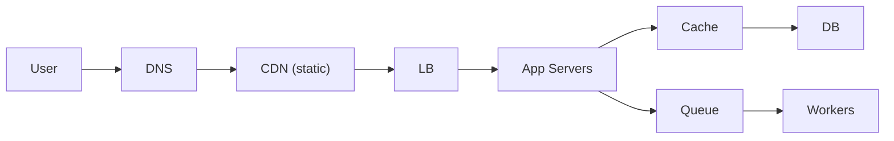

1. User types URL or clicks link.
2. DNS resolves domain to IP address.
3. If the request is for static content, CDN serves it directly.
4. Dynamic requests go to a load balancer.
5. Load balancer distributes traffic across app servers.
6. App servers process the request, reading/writing data.
7. Cache reduces load on the database.
8. Database persists data.
9. Queue + workers handle async tasks.

---

## Component Details

### DNS (Domain Name System)

DNS translates human-readable domain names (e.g., `api.example.com`) to IP addresses.

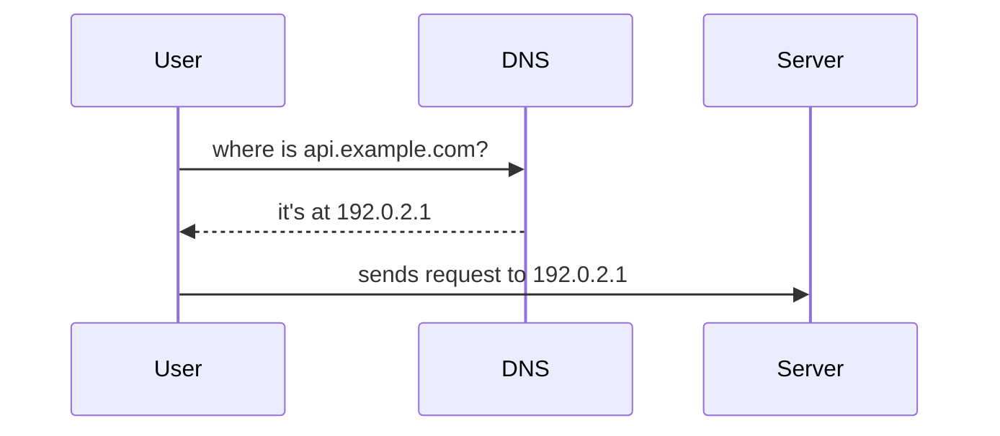

Key points:

- DNS responses are cached at multiple levels (browser, OS, ISP).
- TTL (Time To Live) controls how long DNS records are cached.
- Multiple record types: A (IPv4), AAAA (IPv6), CNAME (alias), MX (mail).
- Geo-based DNS can route users to the nearest region.
- DNS is NOT a load balancer, but can be used for basic routing.

### CDN (Content Delivery Network)

A CDN is a network of servers distributed globally that caches and serves static content (images, CSS, JS, videos) from locations close to users.

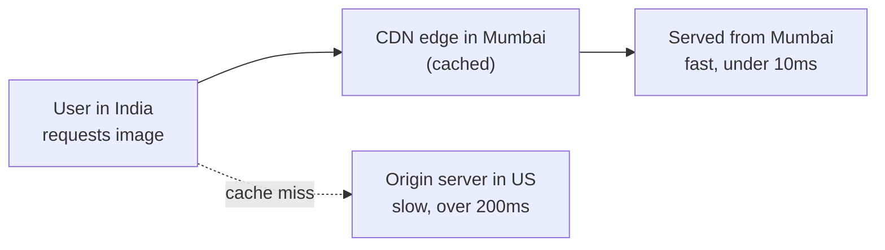

Key points:

- CDN reduces latency for static assets.
- CDN reduces load on origin servers.
- CDNs also handle DDoS mitigation.
- Popular CDNs: CloudFront, Cloudflare, Akamai, Fastly.
- Dynamic content can also be accelerated via CDN (edge computing).

### Load Balancer (LB)

A load balancer distributes incoming traffic across multiple backend servers.

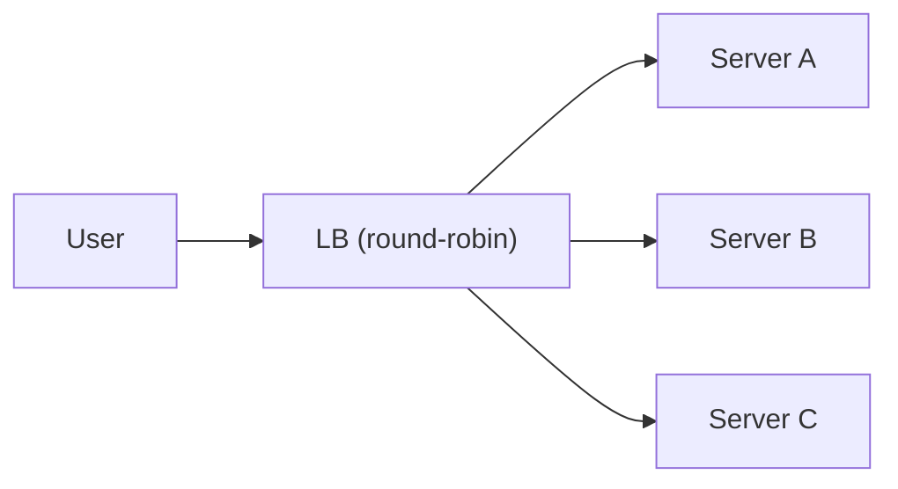

Types:

| Type | Layer | Works with |
| --- | --- | --- |
| Layer 4 (L4) | Transport (TCP/UDP) | IP, port |
| Layer 7 (L7) | Application (HTTP/HTTPS) | URL, headers, cookies |

Key points:

- L4: Faster, simpler, works for any TCP/UDP traffic.
- L7: Can inspect HTTP headers, path, cookies; supports sticky sessions, SSL termination.
- Health checks: LB pings servers and removes unhealthy ones.
- Algorithms: round-robin, least connections, IP hash, weighted.
- LB can be hardware (F5) or software (NGINX, HAProxy, AWS ALB/NLB).

### Application Servers

The compute layer that runs business logic.

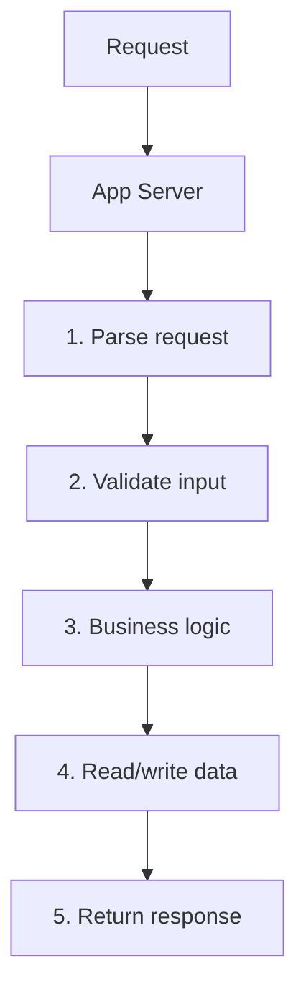

Key points:

- App servers should be stateless for easy scaling.
- Deployed behind a load balancer.
- Multiple instances for redundancy and capacity.
- Can be VMs, containers, or serverless functions.

Why stateless matters for autoscaling

If an app server keeps request state in local memory (e.g. session data), any
request that lands on a different instance loses that state. Keeping servers
stateless — pushing state to a cache or DB — lets the load balancer route any
request to any instance, which is what makes horizontal autoscaling work. See
[Stateless vs Stateful](/system-design/basics/stateless-stateful) for the full
trade-off.

### Database (DB)

Persistent storage for structured data.

Types:

| Type | Examples | Use case |
| --- | --- | --- |
| Relational (SQL) | PostgreSQL, MySQL, SQLite | Structured data, transactions, joins |
| Document (NoSQL) | MongoDB, DynamoDB | Semi-structured data, flexible schemas |
| Key-Value | Redis, Memcached | Caching, session store |
| Wide-column | Cassandra, Scylla | Time-series, high write throughput |
| Graph | Neo4j | Relationships, recommendations |

Key points:

- Read replicas for read-heavy workloads.
- Sharding for write-heavy workloads.
- Connection pooling to handle many concurrent connections.
- Indexes for query performance.
- Migrations for schema changes.

### Cache

Temporary, fast storage for frequently accessed data.

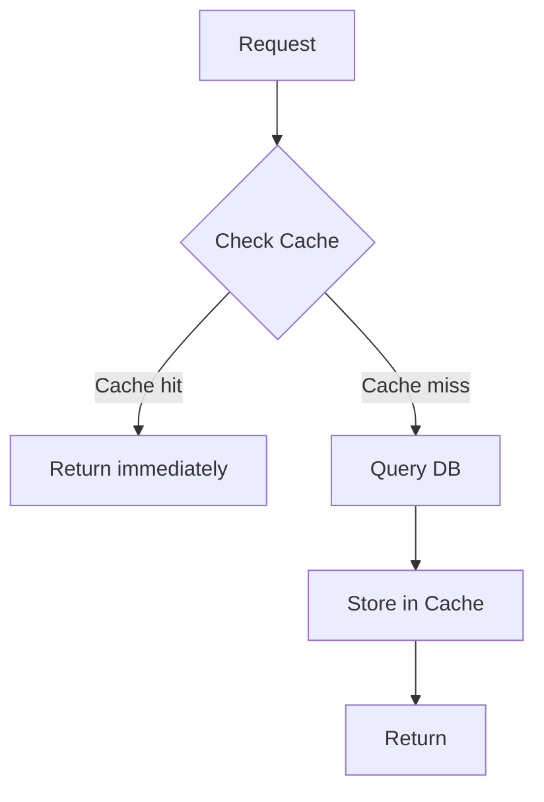

Common patterns:

- **Cache-aside**: App checks cache first, falls back to DB.
- **Write-through**: App writes to cache and DB simultaneously.
- **Write-behind**: App writes to cache, cache asynchronously writes to DB.

Key points:

- Cache improves read latency and reduces DB load.
- Cache needs an eviction policy (LRU, TTL, LFU).
- Cache invalidation is hard (stale data).
- Redis is the most common backend cache.

### Message Queue

Asynchronous buffer between services.

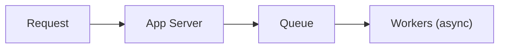

Key points:

- Decouples request handling from processing.
- Absorbs traffic spikes.
- Adds durability (messages survive crashes).
- See `message-queues.md` for details.

---

## Architecture Patterns

### Monolith

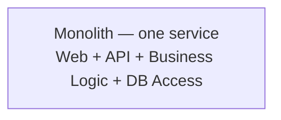

- Simple to start.
- Hard to scale beyond a point.
- Single deployable unit.

### Microservices

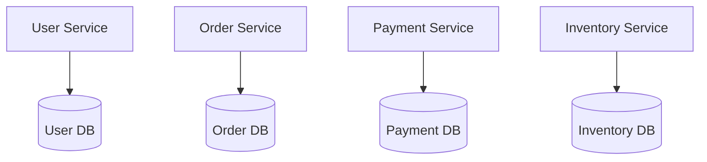

- Each service is independently deployable.
- Services communicate via APIs (HTTP/gRPC) or message queues.
- Complex to operate (service discovery, monitoring, tracing).

### Layered (N-Tier)

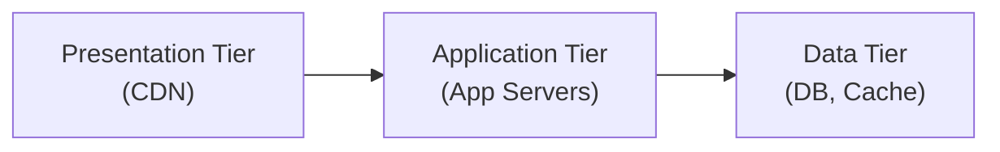

- Each layer has a specific responsibility.
- Layers can scale independently.
- Common in enterprise applications.

---

## Putting It Together

### Simple Architecture

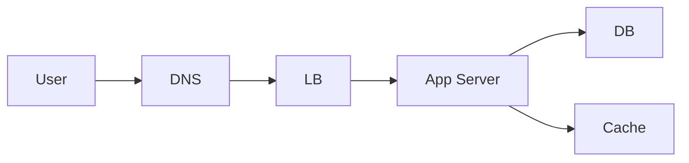

- Single region.
- One load balancer.
- A few app servers.
- One primary DB with read replicas.

### Scaled Architecture

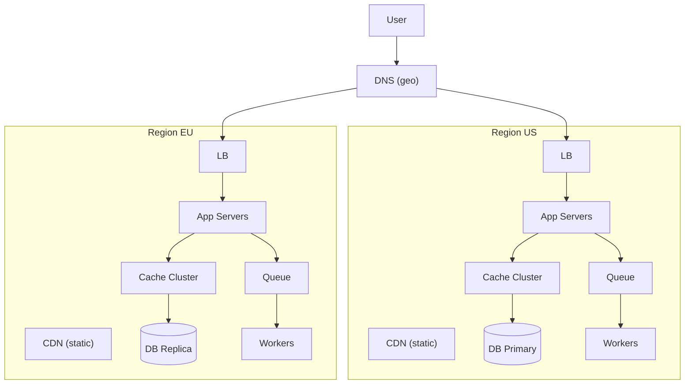

- Multiple regions for lower latency and disaster recovery.
- CDN for static and edge-cached content.
- Load balancers per region.
- App servers automatically scaled.
- Caching layer to reduce DB reads.
- Queue + workers for async processing.
- DB with cross-region replication.

---

## Summary

| Component | Role | Key consideration |
| --- | --- | --- |
| DNS | Domain to IP resolution | TTL, geo-routing |
| CDN | Cache static content globally | Latency, cost, cache hit ratio |
| Load Balancer | Distribute traffic | L4 vs L7, health checks, algorithm |
| App Servers | Business logic | Stateless, horizontal scaling |
| Database | Persistent storage | SQL vs NoSQL, read replicas, sharding |
| Cache | Fast temporary storage | Eviction policy, invalidation |
| Message Queue | Async decoupling | Durability, throughput, ordering |

---

## Concept Map

Click a node to jump to the related note.

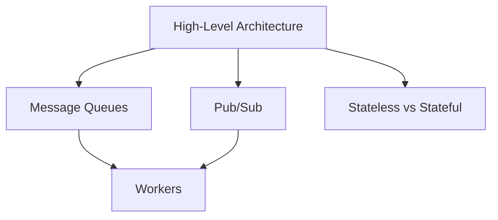
