# Designing a Distributed Key-Value Store

---

## Brief

A key-value store maps a **unique key** to a **value** (`get(key)` /
`put(key, value)`). On a single machine it's trivial — a hash map. The hard
part is making it **distributed**: storing more data than one machine holds,
staying available when machines fail, and keeping replicas consistent.

This note covers the core ideas behind Dynamo-style stores (DynamoDB,
Cassandra, Riak): **CAP**, **consistent hashing**, **replication**, **quorum
consensus**, **vector clocks**, **gossip**, **sloppy quorum + hinted handoff**,
and the **read/write paths**.

### Requirements

- Store **large** data (beyond one machine).
- **High availability** — reads/writes succeed even during failures.
- **Scalability** — add nodes to grow capacity.
- **Tunable consistency** — trade consistency for latency/availability.
- Low latency.

---

## CAP Theorem

The CAP theorem says a distributed data store can guarantee **at most two** of
these three at the same time:

- **Consistency (C):** every read sees the most recent write (or an error).
- **Availability (A):** every request gets a (non-error) response, though it may
  not be the latest data.
- **Partition tolerance (P):** the system keeps working despite the network
  dropping/delaying messages between nodes.

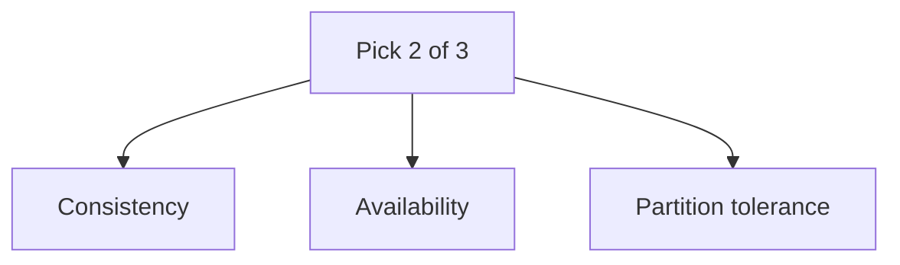

### The variations

| System type | Guarantees | Sacrifices | Reality |
| --- | --- | --- | --- |
| **CA** | Consistency + Availability | Partition tolerance | Only possible if the network **never** partitions — unrealistic for distributed systems. In practice this means a single-node / single-rack store. |
| **CP** | Consistency + Partition tolerance | Availability | On a partition, reject requests that can't be made consistent. Good for **banking, inventory**. e.g. HBase, ZooKeeper, MongoDB (default). |
| **AP** | Availability + Partition tolerance | Strong consistency | On a partition, keep serving (possibly stale) data and reconcile later (**eventual consistency**). Good for **feeds, shopping carts**. e.g. Cassandra, DynamoDB. |

**Key insight:** in any real distributed system, network partitions *will*
happen, so **P is mandatory**. The real choice is **C vs A** during a partition:

- A **CP** system blocks writes to the minority side to avoid divergence.
- An **AP** system accepts writes on both sides and resolves conflicts later.

---

## Data Partitioning — Consistent Hashing

We can't fit all data on one node, so we partition keys across nodes. Naive
`hash(key) % N` reshuffles **almost everything** when `N` changes. **Consistent
hashing** places nodes and keys on a hash ring; a key belongs to the first node
clockwise. Adding/removing a node only moves the keys in **one segment**.

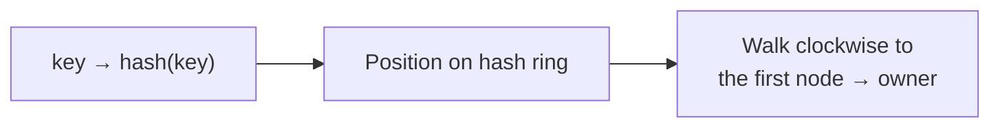

- **Automatic scaling:** add a node → it takes over part of one neighbor's
  range; remove a node → its range goes to the next node.
- **Virtual nodes:** each physical node maps to many points on the ring, which
  smooths out load imbalance.

---

## Data Replication

To survive node failure, each key is replicated to **N** nodes: the owner plus
the next **N-1** nodes clockwise on the ring (skipping virtual nodes that map to
the same physical node, so replicas land on **distinct** machines).

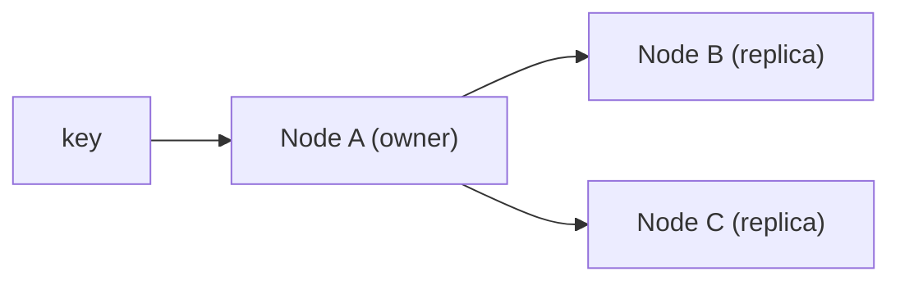

With `N = 3`, the data lives on 3 distinct nodes, often spread across racks /
data centers for durability.

---

## Consistency — Quorum Consensus

Quorums let you **tune** consistency vs latency. Define:

- **N** = number of replicas.
- **W** = **write quorum** — a write must be acknowledged by **W** replicas
  before it's considered successful.
- **R** = **read quorum** — a read must gather responses from **R** replicas
  before returning.

### The formula

```text
W + R > N   ⟹   strong consistency
```

If `W + R > N`, the write set and read set **must overlap by at least one
node** — guaranteeing at least one replica in any read has the latest write, so
reads see the newest data.

### Examples (N = 3)

| W | R | W + R | Consistency | Trade-off |
| --- | --- | --- | --- | --- |
| 1 | 1 | 2 | **Not** strong (2 ≤ 3) | Fastest reads + writes, may read stale |
| 2 | 2 | 4 | **Strong** (4 > 3) | Balanced — common default |
| 3 | 1 | 4 | **Strong** | Slow writes, fast reads → read-heavy |
| 1 | 3 | 4 | **Strong** | Fast writes, slow reads → write-heavy |

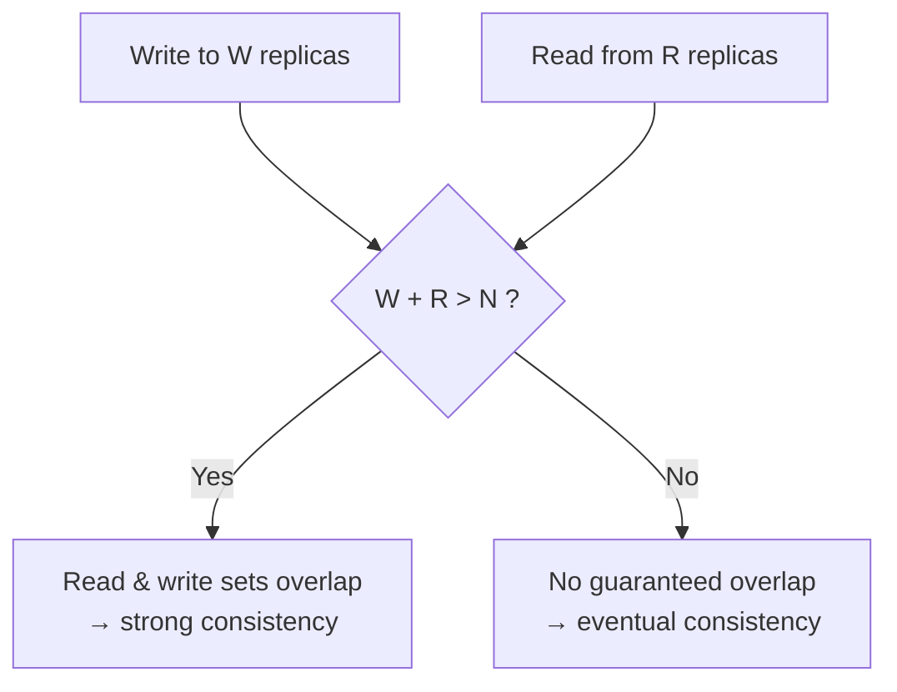

- Smaller **W** → lower write latency. Smaller **R** → lower read latency.
- A **coordinator node** fronts each request, forwards to replicas, and waits
  for W (or R) acks before responding to the client.

---

## Inconsistency Resolution — Version Clocks (Vector Clocks)

With concurrent writes to different replicas, versions can **diverge**. A
**vector clock** detects and helps resolve these conflicts. It's a set of
`[server, counter]` pairs attached to each value: `D([Sx, 1], [Sy, 2], ...)`.

- When a write is handled by server `Si`, **increment the counter for `Si`**.
- Version **X is an ancestor of Y** (no conflict, Y is newer) if **every**
  counter in X is **≤** the matching counter in Y.
- Otherwise the versions are **siblings / conflicting** → the client must
  **reconcile** (merge) them on the next read.

### Worked example

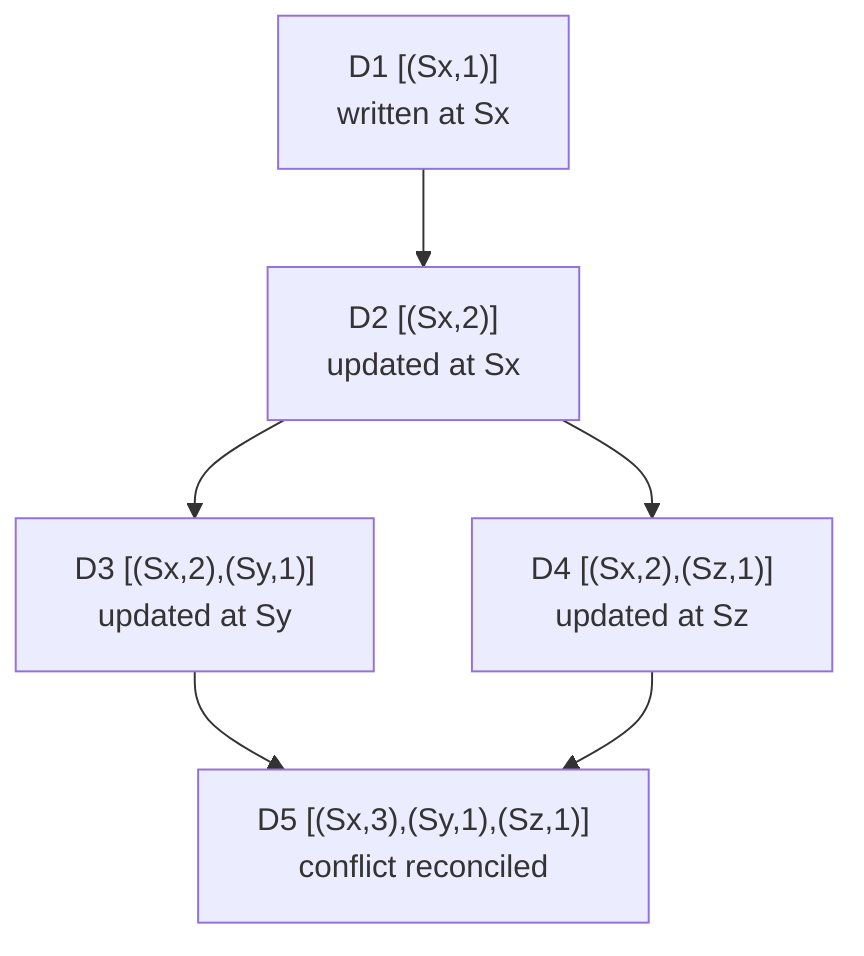

`D3` and `D4` both descend from `D2` but neither is an ancestor of the other →
**conflict**. The client reads both siblings, merges them, and writes `D5`,
which dominates both.

- **Downsides:** the client gets conflict-resolution complexity; the vector
  clock can **grow** as more servers touch a key (mitigate by capping its
  length and evicting the oldest `[server, counter]` pairs by timestamp).

---

## Failure Detection — Gossip Protocol

A node can't rely on one central monitor to know who's alive. **Gossip** is a
decentralized, epidemic membership/failure-detection protocol:

- Each node keeps a **membership list**: `member id → heartbeat counter` +
  last-seen time.
- Periodically, a node **increments its own heartbeat** and sends its list to a
  few **random** nodes.
- Receivers **merge** the lists, keeping the highest heartbeat per member, and
  gossip onward — so updates spread exponentially.
- If a member's heartbeat hasn't increased for longer than a threshold, it's
  marked **offline** (and that suspicion also propagates via gossip).

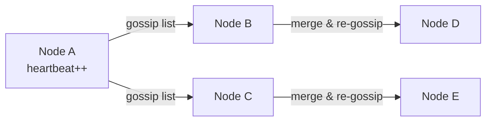

---

## Handling Temporary Failures — Sloppy Quorum + Hinted Handoff

A **strict** quorum blocks writes/reads when too many of the *home* replicas are
temporarily down — hurting availability. Dynamo-style stores relax this:

- **Sloppy quorum:** instead of insisting on the canonical N replicas, the
  coordinator picks the **first W healthy nodes** (and R for reads) walking the
  ring — even if they aren't the usual owners. The system stays available.
- **Hinted handoff:** when a replica is down, another node temporarily stores
  the write **with a hint** noting the intended recipient. When the original
  node recovers, the data is **handed off** back to it, then the hint is
  dropped.

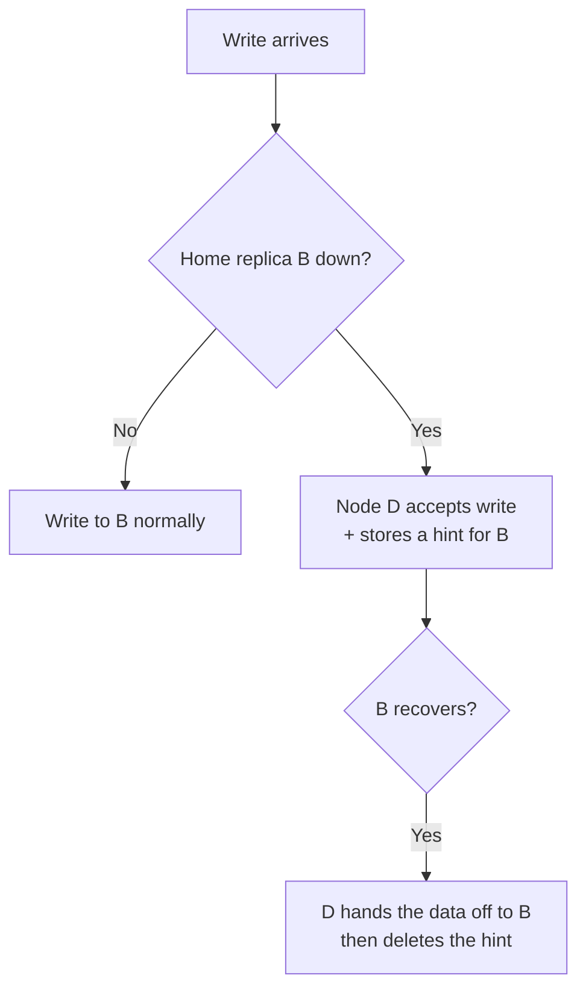

> For **permanent** failures, replicas re-sync using **anti-entropy** with
> **Merkle trees** — comparing tree hashes so only the differing key ranges are
> transferred, not the whole dataset.

---

## Write Path

Modeled on the LSM-tree storage engine used by Cassandra/Bigtable:

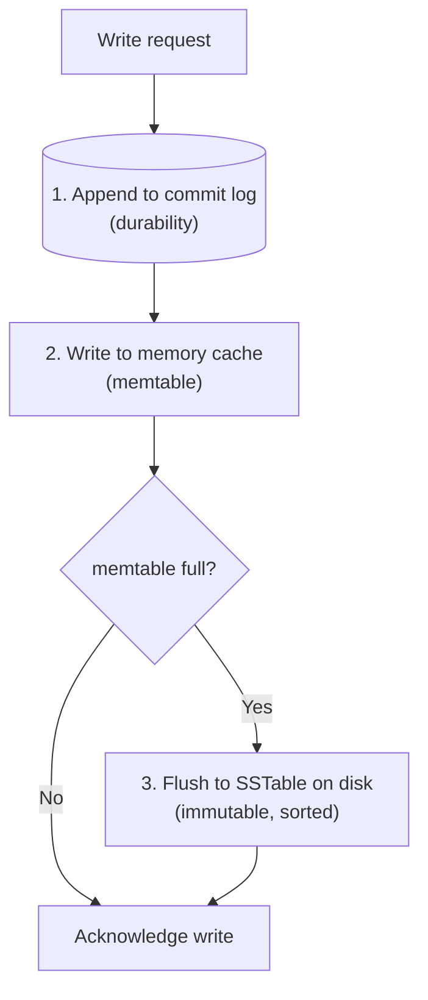

1. The write is appended to a **commit log** on disk (so it survives a crash).
2. It's written to an in-memory structure (**memtable**).
3. When the memtable is full, it's **flushed** to an immutable, sorted file
   (**SSTable**) on disk.

---

## Read Path

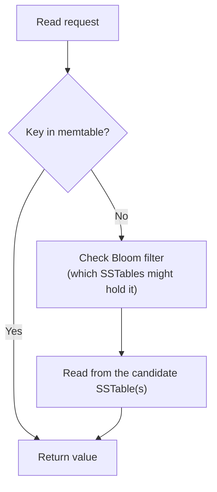

1. If the key is in the **memtable**, return it directly.
2. Otherwise consult a **Bloom filter** to figure out which SSTables *might*
   contain the key (avoiding scanning every file).
3. Read the value from those SSTable(s) and return it.

---

## System Architecture (putting it together)

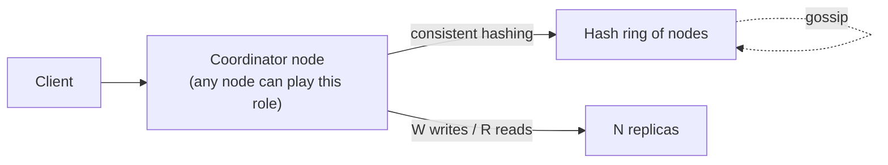

Every node is functionally identical (**decentralized**): it can act as the
coordinator, knows the ring via gossip, and stores its share of replicas.

---

## Summary

| Concern | Technique |
| --- | --- |
| Big data / scaling | Consistent hashing (with virtual nodes) |
| Availability | Replication across N nodes |
| Tunable consistency | Quorum: `W + R > N` ⟹ strong |
| Conflict detection | Vector (version) clocks |
| Membership / failure detection | Gossip protocol |
| Temporary failures | Sloppy quorum + hinted handoff |
| Permanent failures | Anti-entropy with Merkle trees |
| Storage | Commit log → memtable → SSTable (write); Bloom filter + SSTable (read) |

The big idea: pick your spot on the **CAP** spectrum, then use **quorums** to
dial consistency vs latency, and lean on **gossip + hinted handoff** to stay
available through failures.

---

## Concept Map

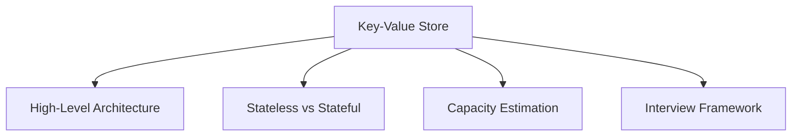
