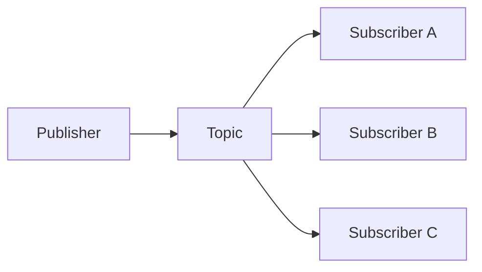
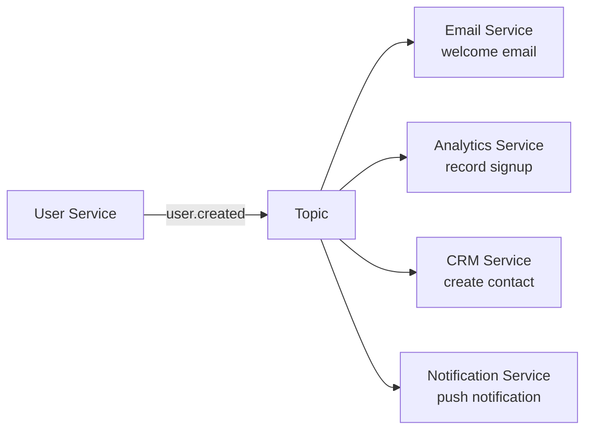
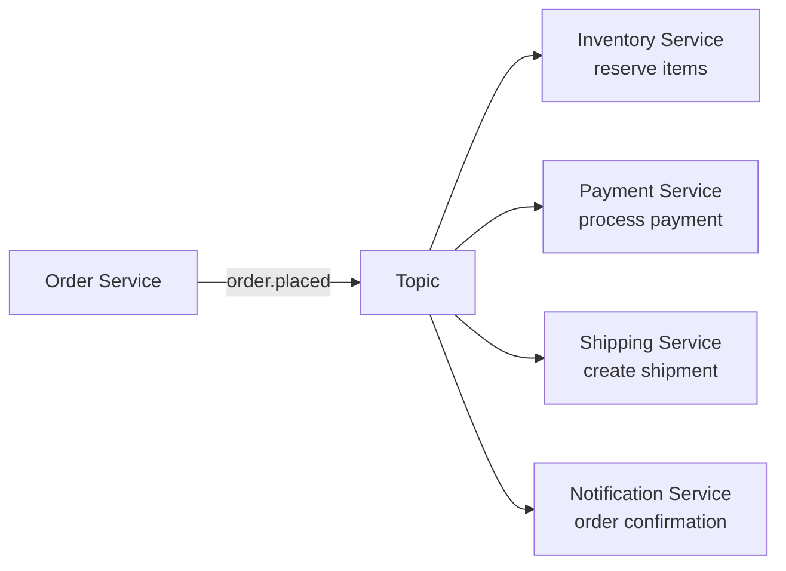
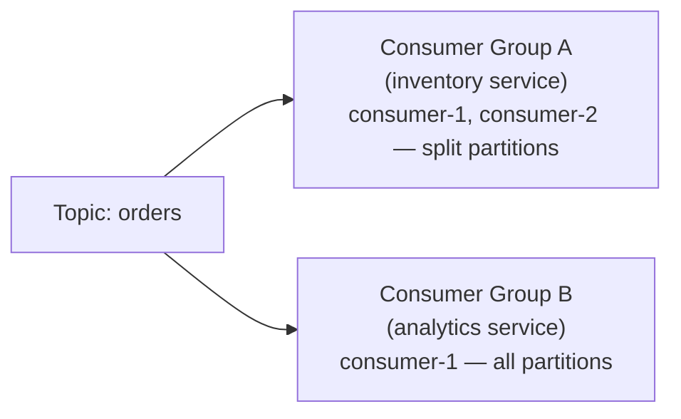
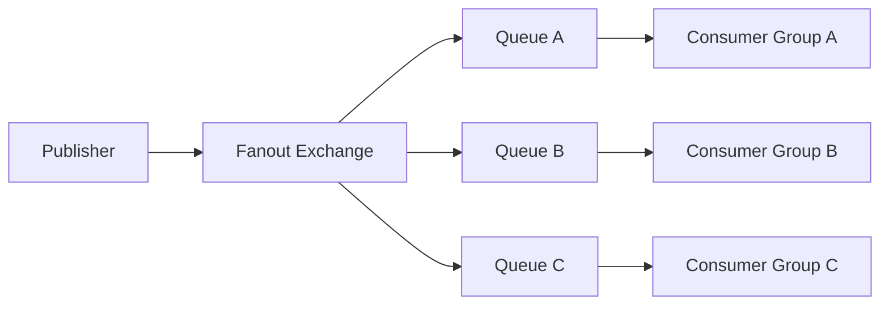
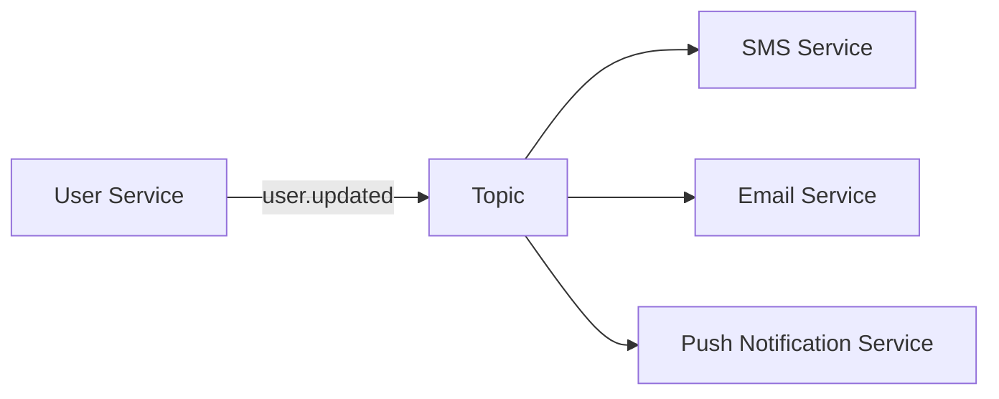
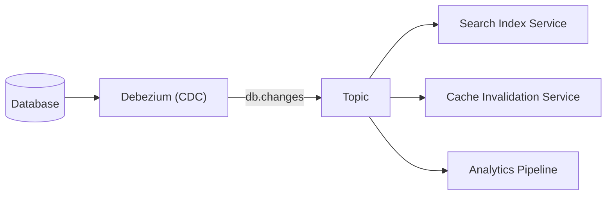
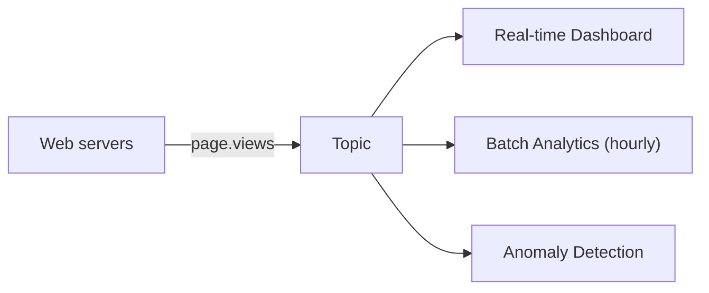

# Publish-Subscribe (Pub/Sub) Pattern

---

## Brief

Pub/Sub is a messaging pattern where senders (publishers) do not send messages directly to specific receivers (subscribers). Instead, messages are categorized into topics or channels, and subscribers receive messages based on their subscriptions.

The key idea: **publishers and subscribers are decoupled**. They don't know about each other.

---

## How It Works

1. Publishers send messages to a topic.
2. The pub/sub system delivers the message to all subscribers of that topic.
3. Each subscriber processes the message independently.

---

## Core Concepts

### Publisher

The service that produces messages. It does not know who receives them.

### Subscriber

The service that receives messages. It does not know who published them.

### Topic

A named channel that groups related messages. Subscribers express interest in one or more topics.

### Subscription

A binding between a subscriber and a topic. The system ensures the subscriber receives messages for that topic.

### Fan-out

The pattern of delivering one message to many subscribers.

---

## Pub/Sub vs Message Queues

| Aspect | Pub/Sub | Message Queue |
| --- | --- | --- |
| Delivery | One message to many subscribers | One message to one consumer |
| Decoupling | Publisher has no idea about subscribers | Producer might know there's a consumer |
| Use case | Broadcasting events | Distributing tasks |
| Example | User signed up -> Email service + Analytics + Welcome SMS | Image upload -> thumbnail worker |

### Relationship

Message queues and pub/sub are related but not the same:

- A message queue with a **fanout exchange** (RabbitMQ) is a pub/sub system.
- Kafka topics with **multiple consumer groups** is a pub/sub system.
- A message queue with **competing consumers** is NOT pub/sub (it's work queue).

---

## When to Use Pub/Sub

### Good Fit

- **Event broadcasting**: One event triggers multiple downstream actions.
- **Decoupled microservices**: Services don't need to know each other.
- **Real-time updates**: Feed updates to multiple clients.
- **Data replication**: Send changes to multiple data stores.
- **Audit logging**: Multiple services subscribe to audit events.

### Backend Examples

---

## Pub/Sub in Kafka

In Kafka, pub/sub is implemented through consumer groups:

- Each consumer group is an independent subscriber.
- All messages go to all consumer groups (fan-out).
- Within a consumer group, partitions are split among consumers (work queue).

---

## Pub/Sub in RabbitMQ

In RabbitMQ, pub/sub uses a **fanout exchange**:

- All queues bound to the fanout exchange get every message.
- Each queue can have multiple consumers (competing within that queue).

---

## Common Challenges

### Message Ordering

In a pub/sub system, messages may arrive in different order at different subscribers. If ordering matters, use:

- Kafka (ordered within a partition per consumer group).
- Sequence numbers or timestamps in messages.

### Duplicate Messages

Pub/Sub systems often deliver at-least-once. Consumers should be **idempotent**.

### Slow Subscribers

A slow subscriber can cause backpressure. Solutions:

- Buffer messages (increase retention).
- Use dead-letter queues for failed messages.
- Alert on subscriber lag.

### Subscriber Churn

Subscribers come and go. The system should handle:

- New subscribers catching up (replay or ignore past messages).
- Disconnected subscribers (queue messages for later).

---

## Pub/Sub in Practice

### Notification System

### Change Data Capture (CDC)

### Real-Time Analytics

---

## Summary

| Concept | Description |
| --- | --- |
| Pattern | Publishers send to topics, subscribers receive copies |
| Decoupling | Publishers don't know subscribers, subscribers don't know publishers |
| Fan-out | One message delivered to all subscribers |
| Kafka impl | Consumer groups on a topic |
| RabbitMQ impl | Fanout exchange bound to multiple queues |
| Common uses | Event broadcasting, microservices decoupling, real-time updates |
| Gotchas | Ordering, duplicates, slow subscribers |
