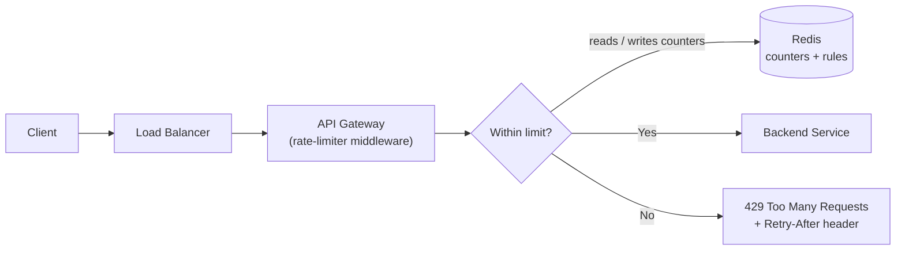
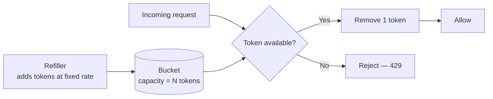
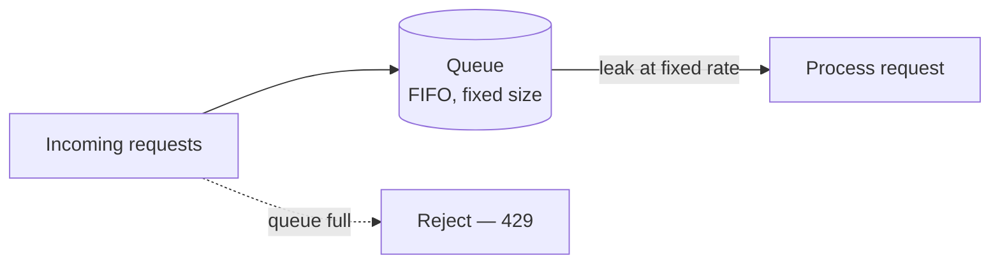
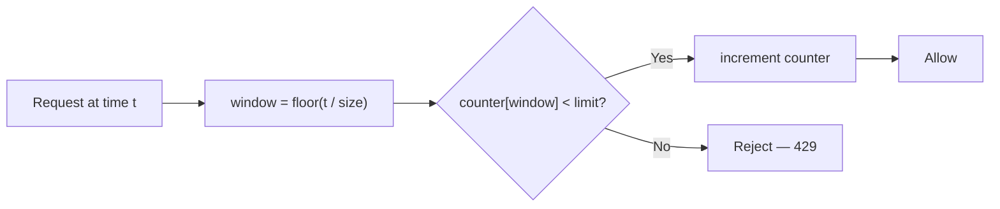
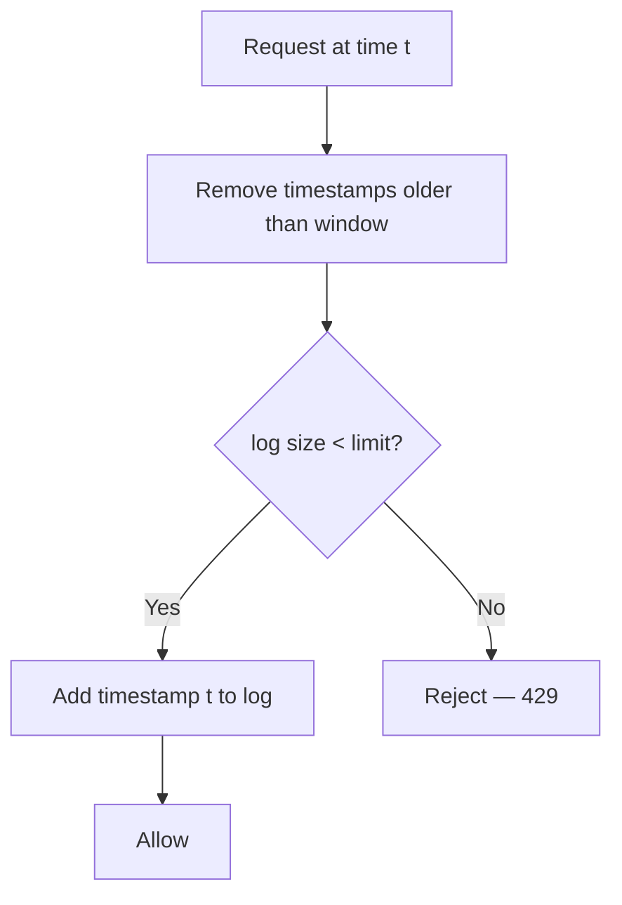
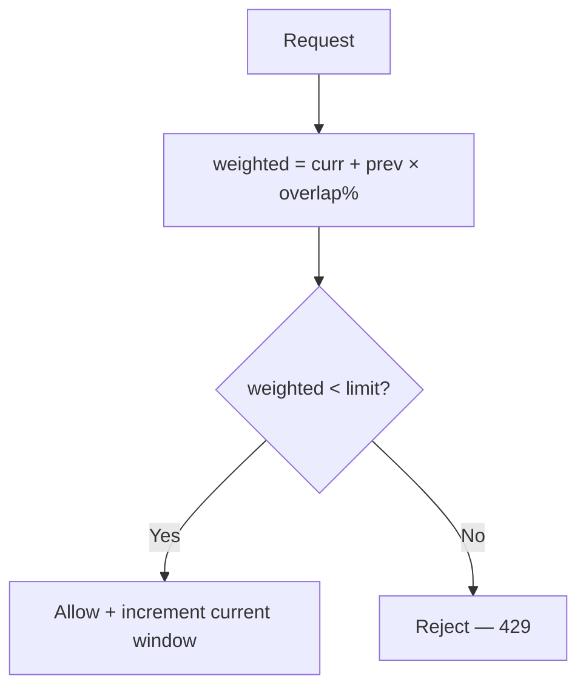
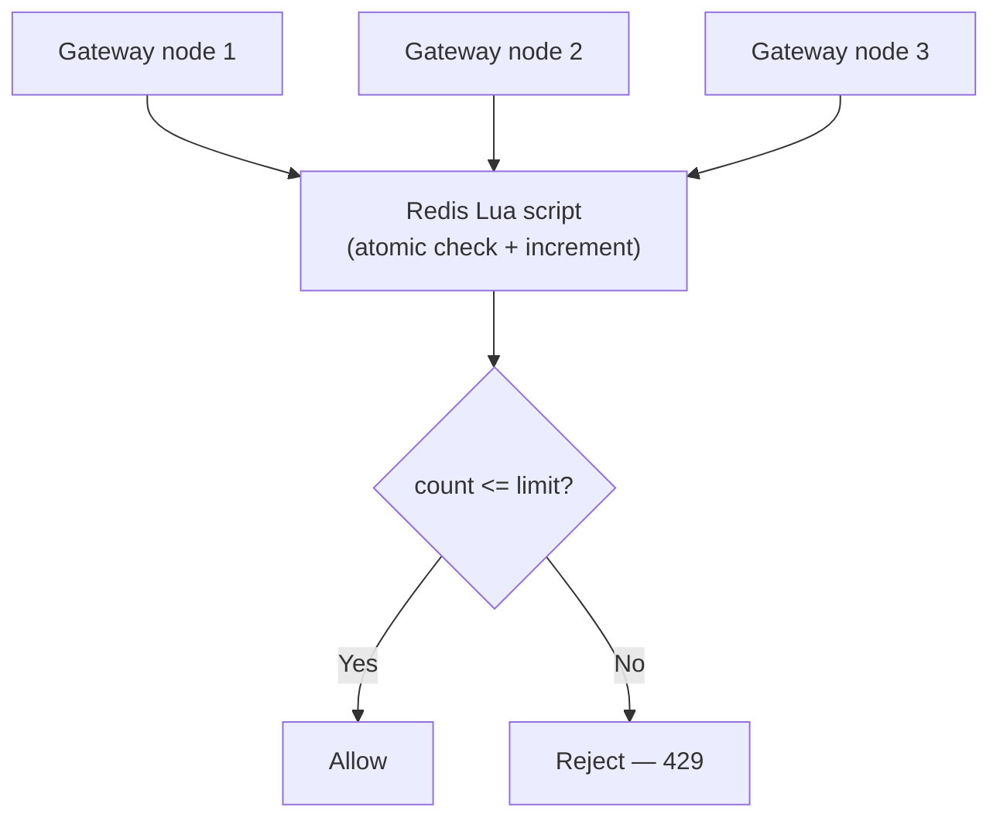
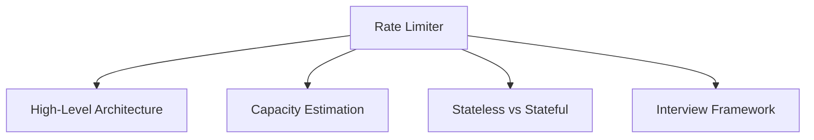

# Rate Limiter

---

## Brief

A rate limiter controls how many requests a client can make in a given window.
It protects backends from abuse, accidental traffic storms, scrapers, and
brute-force attacks; it keeps costs predictable; and it enforces fair usage
across tenants. It usually lives at the edge — in an API gateway or a
middleware in front of the service — so bad traffic is rejected before it
reaches business logic.

When a client exceeds its limit, the limiter returns **HTTP 429 (Too Many
Requests)**, ideally with `Retry-After` and `X-RateLimit-*` headers.

This note follows the interview framework: **clarify → HLD → deep dive →
issues**, and covers the five classic algorithms.

```youtube
https://www.youtube.com/watch?v=lm0vslSvUeE
```

---

## 1. Requirements, Assumptions & Capacity Estimation

### Clarifying Questions

| Aspect | Questions to ask |
| --- | --- |
| Placement | Client-side or server-side? Edge gateway or per-service? |
| Throttle key | Limit by user ID, API key, or IP? A combination? |
| Limit shape | Requests/second, requests/minute, or burst + sustained? |
| Scope | Single server or **distributed** across many instances? |
| Accuracy | Must it be exact, or is a small overshoot acceptable? |
| Behaviour | Hard reject (429) or soft (queue/throttle)? |
| Failure mode | If the limiter's store is down — **fail open** or **fail closed**? |

### Assumptions (worked example)

```text
Users (DAU):            10 million
Limit per user:         10 req/s  (≈ 600 req/min)
Average API QPS:        ~100,000 req/s
Peak factor:            3x  → 300,000 req/s
Deployment:             distributed (many gateway nodes)
Store:                  centralized Redis cluster
Accuracy target:        small overshoot acceptable at boundaries
```

### Back-of-the-Envelope

```text
Counter store (per user):
  key + counter + timestamp ≈ 20 bytes
  10M users × 20 bytes      ≈ 200 MB   → easily fits in Redis memory

Store ops:
  Every request does 1 read + 1 write (or 1 atomic op)
  Peak 300k req/s → ~300k Redis ops/s
  One Redis node handles ~100k ops/s → shard or use a small cluster
```

The limiter must add **minimal latency** (sub-millisecond) and must **not** be
a single point of failure for the whole API.

---

## 2. High-Level Design

The limiter is middleware in the API gateway. It reads counters from a fast
centralized store (Redis) so the decision is consistent across all gateway
nodes.



1. Request hits the load balancer, then the gateway.
2. The rate-limiter middleware derives the **key** (e.g. `user:123`).
3. It checks/updates the counter for that key in Redis.
4. **Under limit** → forward to the backend. **Over limit** → return 429.
5. Rules (limits per route/tier) are loaded from config and cached in memory.

---

## 3. Design Deep Dive (LLD) — The Five Algorithms

### 1. Token Bucket

A bucket holds up to `N` tokens and is refilled at a fixed rate. Each request
removes one token; if the bucket is empty, the request is rejected. Allows
**bursts** up to the bucket size while bounding the long-run average rate.



- **Pros:** Allows bursts, memory-efficient (two numbers per key: tokens + last
  refill time), widely used (Stripe, AWS).
- **Cons:** Two parameters (rate + bucket size) to tune.

### 2. Leaking Bucket

Requests enter a fixed-size FIFO queue and are processed ("leak") at a constant
rate. If the queue is full, new requests are dropped. Smooths bursts into a
**steady** outflow.



- **Pros:** Stable, predictable outflow rate; good for smoothing.
- **Cons:** Bursts are delayed (queued), not served immediately; recent traffic
  can wait behind a full queue.

### 3. Fixed Window Counter

Time is divided into fixed windows (e.g. each minute). A counter per key counts
requests in the current window and resets when the window rolls over.



- **Pros:** Trivial to implement; one counter per key; memory-cheap.
- **Cons:** **Boundary burst** — a client can send `limit` requests at the end
  of one window and `limit` again at the start of the next, briefly doubling the
  rate.

### 4. Sliding Window Log

Store a timestamp for every request in a sorted set. On each request, drop
timestamps older than the window, then allow only if the remaining count is
below the limit. **Exact** — no boundary problem.



- **Pros:** Perfectly accurate; no boundary spikes.
- **Cons:** Memory-heavy — stores one entry **per request** per key; expensive
  at high QPS.

### 5. Sliding Window Counter

A hybrid that approximates the sliding log cheaply. It weights the previous
window's count by how much of it still overlaps the rolling window:

```text
weighted = current_window_count
         + previous_window_count × (overlap fraction of previous window)
```



- **Pros:** Near-exact, smooths the boundary spike, only **two counters** per
  key — cheap. This is the common production default.
- **Cons:** A slight approximation (assumes even distribution in the previous
  window).

<details>
<summary>Which algorithm should I pick?</summary>

- **Need to allow bursts** (typical public API) → **Token Bucket**.
- **Need a strictly smooth outflow** (protect a fragile downstream) → **Leaking
  Bucket**.
- **Simplest possible, small overshoot OK** → **Fixed Window Counter**.
- **Must be exact, low traffic** → **Sliding Window Log**.
- **Accurate *and* cheap at scale** → **Sliding Window Counter** (good default).

</details>

### Storing Counters

Counters live in **Redis** (centralized) so every gateway node sees the same
state. Use `INCR`/`EXPIRE` or sorted sets, and wrap the read-modify-write in a
**Lua script** so the check-and-increment is atomic (see Issues below).

---

## 4. Issues & How the Design Tackles Them

| Issue | Why it happens | How the design handles it |
| --- | --- | --- |
| **Race condition** | Two nodes read the same counter, both see "under limit", both increment → overshoot | Make check-and-increment **atomic** with a Redis **Lua script** (or `INCR` + `EXPIRE`); avoids read-then-write gaps |
| **Distributed consistency** | Per-node in-memory counters drift across the fleet | Use a **centralized store** (Redis) as the source of truth; all nodes share it |
| **Latency** | A Redis round-trip on every request adds delay | Keep Redis **co-located/low-RTT**; pipeline ops; optionally a local token bucket as an approximate first pass |
| **Store outage** | Redis down → can't read counters | Decide policy up front: **fail open** (allow traffic, protect availability) or **fail closed** (reject, protect backend). Add a local fallback limiter |
| **Hot key** | One huge tenant hammers a single counter key | Shard the key (e.g. `user:123:{shard}`) and sum; or apply a local cap before the shared check |
| **Boundary burst** | Fixed-window resets let 2× through at the edge | Use **sliding window counter/log** instead of fixed window |
| **Client experience** | Clients don't know they're limited | Return **429** with `Retry-After` and `X-RateLimit-Limit/Remaining/Reset` headers |

The atomic, distributed-counter path:



---

## Summary

| Algorithm | Bursts | Accuracy | Memory | Best for |
| --- | --- | --- | --- | --- |
| Token Bucket | Allowed | Good | Low (2 values) | Public APIs that tolerate bursts |
| Leaking Bucket | Smoothed/queued | Good | Low–medium | Strictly steady outflow |
| Fixed Window | Boundary spike | Approximate | Low | Simplest case |
| Sliding Window Log | None | Exact | High (per request) | Low-traffic, exactness required |
| Sliding Window Counter | Slight | Near-exact | Low (2 counters) | **Accurate + cheap default** |

Key takeaways: put the limiter at the **edge**, keep counters in a **shared
store**, make the check **atomic**, choose **fail-open vs fail-closed**
deliberately, and return **429 + headers** so clients can back off.

---

## Concept Map

Click a node to jump to the related note.


