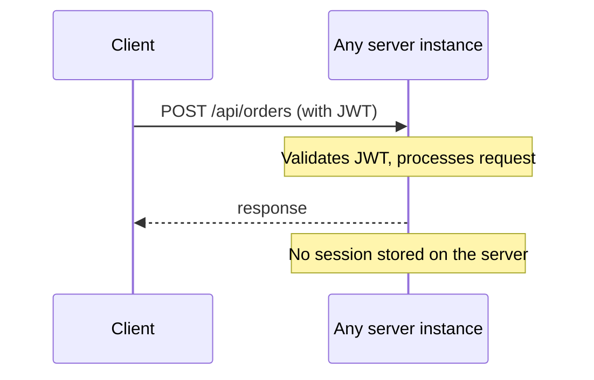
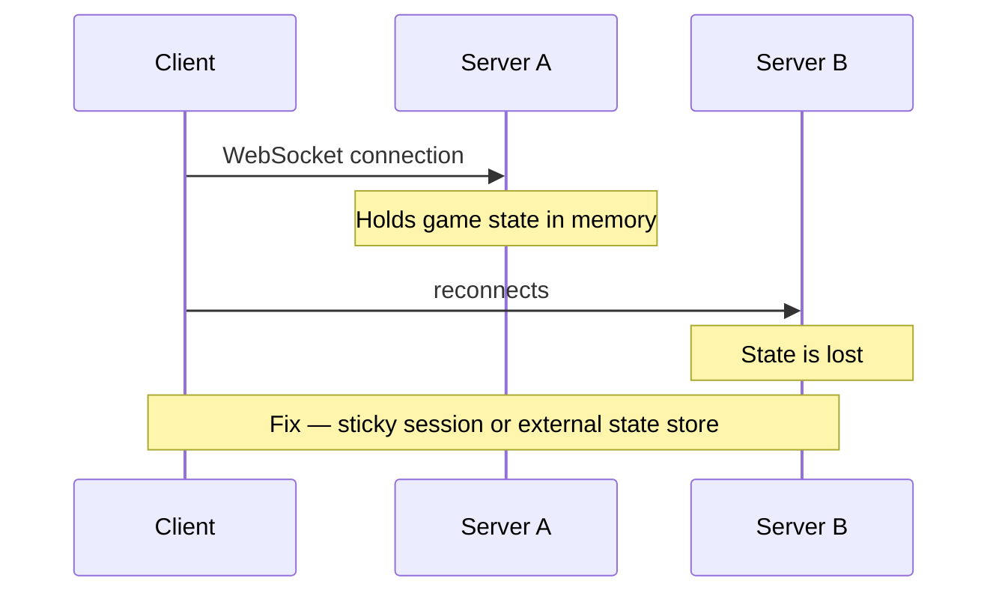
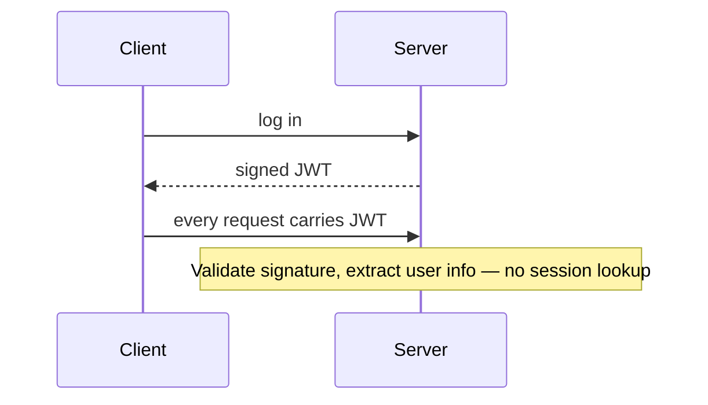
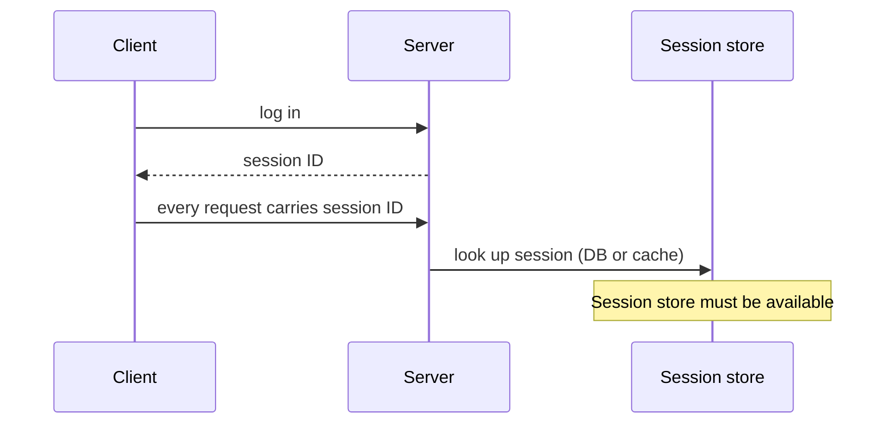
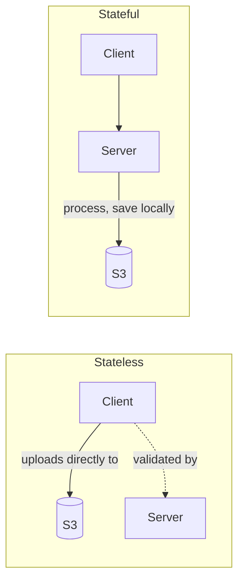

# Stateless vs Stateful Services

---

## Brief

Stateless and stateful describe whether a server retains client data between requests.

- **Stateless**: Each request is independent. The server does not store any session or context between requests.
- **Stateful**: The server stores session data or context between requests. Subsequent requests from the same client may need to reach the same server.

---

## Stateless Services

### Characteristics

- No session data stored on the server.
- Any request can go to any instance.
- Easy to scale horizontally (add/remove instances freely).
- Easy to recover from failure (just restart).
- Session data is stored externally (Redis, DB, client-side token).

### Examples

- REST API with JWT auth (token carries session data).
- Search API.
- CDN serving static files.

### Backend Example

### Pros

- Simple horizontal scaling.
- Simple deployment (blue-green, rolling updates work well).
- No sticky sessions needed on the load balancer.
- Failures are isolated; any instance can replace another.

### Cons

- Each request must carry all context (larger payloads).
- External session store is needed (extra latency, extra dependency).

---

## Stateful Services

### Characteristics

- Server stores client session/context between requests.
- Requests from the same client often need to reach the same server (sticky sessions).
- Harder to scale horizontally.
- State can be in-memory, local disk, or attached storage.

### Examples

- WebSocket game server (player position in memory).
- Video transcoding server (working with large files locally).
- Database primary node (writes go to one instance).

### Backend Example

### Pros

- Lower latency for session-aware operations (no external store call).
- Simpler architecture for certain workloads (e.g., in-memory cache).
- Predictable data locality.

### Cons

- Hard to scale horizontally.
- Failures lose in-memory state unless replicated.
- Sticky sessions complicate load balancer config.
- Rolling deployments are trickier (drain connections carefully).

---

## Stateless vs Stateful Trade-offs

| Aspect | Stateless | Stateful |
| --- | --- | --- |
| Scaling | Trivial (add instances) | Complex (shard, replicate, rebalance) |
| Failure recovery | Instant (any instance works) | Slow (rebuild state, promote replica) |
| Deployment | Easy (rolling, blue-green) | Careful (drain, migrate state) |
| Performance | External store latency | In-memory, no external call |
| Complexity | Simple server logic | State management logic |
| LB config | Round-robin | Sticky sessions |

---

## How to Decide

### Prefer Stateless When

- The service is an API gateway or REST API.
- Session data can be stored externally or in client tokens.
- You need to scale up and down frequently.
- You want simple deployments.

### Prefer Stateful When

- You need very low latency for session data (game server, real-time).
- The workload is inherently tied to a machine (DB primary, file processing).
- The state is large and expensive to move.

### Common Pattern

Make the service layer stateless. Push state to dedicated systems:

- Session store: Redis.
- Persistence: Database.
- File storage: S3.
- Cache: Redis/Memcached.

This way app servers remain stateless and scalable, while state is managed by systems designed for it.

---

## Statelessness in Practice

### JWT Authentication

**Stateless auth flow:**

**Stateful auth flow:**

### REST APIs

REST APIs are naturally stateless. Each request contains all the information needed to process it. This is a key constraint of REST.

### File Upload Services

---

## Summary

| Concept | Stateless | Stateful |
| --- | --- | --- |
| Where is session data? | Client/external store | Server memory/disk |
| Horizontal scaling | Easy | Hard |
| Load balancer | Round-robin | Sticky sessions |
| Failure recovery | Instant | Slow |
| Deployment | Simple | Complex |
| Best for | APIs, compute | Game servers, DBs |
