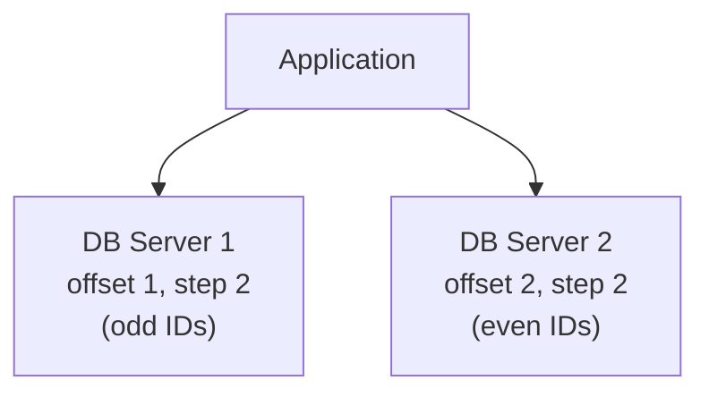
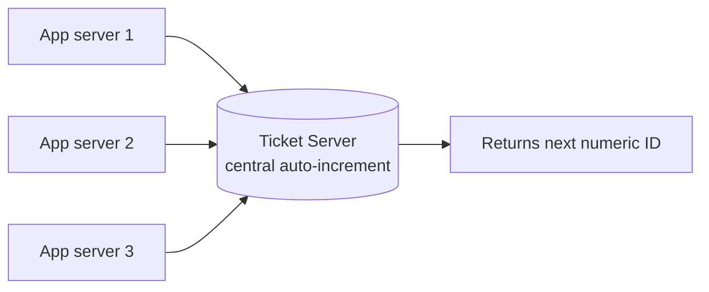
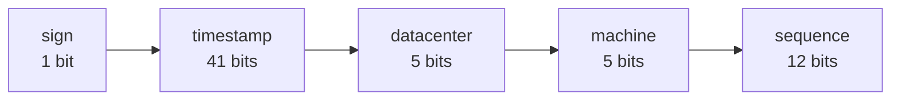
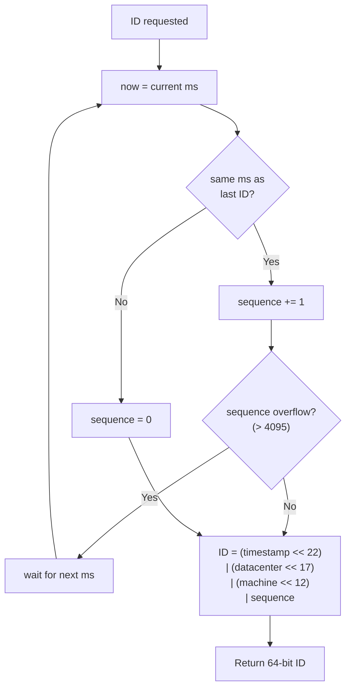
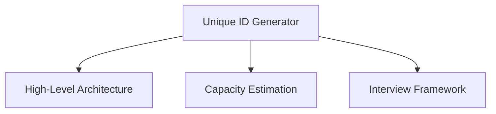

# Unique ID Generator in Distributed Systems

---

## Brief

Generating unique IDs is a deceptively hard problem at scale. A single
database's `AUTO_INCREMENT` works on one machine, but the moment you have
multiple database servers (sharded or replicated), a single auto-increment
column no longer works — two servers would hand out the same number.

We need IDs that are:

- **Unique** across the whole system.
- **Numeric** (often 64-bit, so they fit a `BIGINT` / signed `long`).
- **Roughly time-sortable** — newer IDs should be larger, so you can sort by ID
  and get chronological order (useful for feeds, pagination).
- **Generated at high throughput** with low latency.
- **Generated without a single point of failure**.

This note compares four approaches and goes deep on **Twitter Snowflake**.

---

## 1. Multi-Master Replication

Use database `AUTO_INCREMENT`, but configure each server to increment by **k**
(the number of servers) instead of by 1, with a different starting offset per
server. With two servers:

```text
Server 1: auto_increment_increment = 2, offset = 1  → 1, 3, 5, 7, ...
Server 2: auto_increment_increment = 2, offset = 2  → 2, 4, 6, 8, ...
```



- **Pros:** No central coordinator; scales writes across masters.
- **Cons:**
  - IDs **don't increase over time across servers** (server 1 may be at 1001
    while server 2 is at 8) — so they aren't globally time-sortable.
  - **Adding/removing a server** is painful: the step `k` is baked into every
    server's config, so resizing the cluster requires replanning offsets.
  - Doesn't scale cleanly across multiple data centers.

---

## 2. UUID (128-bit)

A UUID is a 128-bit value generated **independently** on each machine, with
effectively zero collision probability (UUID v4 is random).

- **Pros:** No coordination at all — each server generates its own; trivially
  scalable; no single point of failure.
- **Cons:**
  - **128 bits** — twice the size of a 64-bit ID; bloats indexes and storage.
  - **Not numeric** and **not time-sortable** (v4 is random; v1 embeds time but
    orders by node/MAC, so it's not cleanly monotonic).
  - Can't be used where a compact, ordered numeric key is required.

---

## 3. Ticket Server (Flickr)

Use a **single dedicated database** as a centralized auto-increment service. A
common trick is MySQL's `REPLACE INTO` on a one-row table to atomically bump and
return the next number.



- **Pros:** Produces clean numeric IDs; simple to reason about.
- **Cons:** The single ticket server is a **single point of failure**. You can
  run **two ticket servers** (one odd, one even — same offset/step trick as
  multi-master) for redundancy, but that reintroduces the resize problem and
  loses strict ordering.

---

## 4. Twitter Snowflake (deep dive)

Snowflake sidesteps central coordination by **encoding structure into a 64-bit
ID**. Instead of asking a shared service for the next number, each machine
generates IDs locally by packing a timestamp, machine identity, and a per-ms
sequence number into 64 bits.

### Bit layout (64 bits)

| Bits | Field | Size | Meaning |
| --- | --- | --- | --- |
| 1 | Sign bit | 1 bit | Always `0` — keeps the ID positive |
| 2–42 | Timestamp | 41 bits | Milliseconds since a **custom epoch** |
| 43–47 | Datacenter ID | 5 bits | Up to **32** datacenters |
| 48–52 | Machine ID | 5 bits | Up to **32** machines per datacenter |
| 53–64 | Sequence | 12 bits | Counter that resets every millisecond |



### Why each field matters

- **Timestamp (41 bits)** sits in the **high bits**, so IDs generated later are
  numerically larger → IDs are **roughly time-sortable**. 41 bits of
  milliseconds ≈ 2⁴¹ ms ≈ **69 years** of range from the custom epoch.
- **Custom epoch:** Snowflake counts ms from a chosen start date (e.g. the
  service's launch) rather than the Unix epoch, so the 69-year budget starts
  when you deploy instead of in 1970.
- **Datacenter ID + Machine ID (5 + 5 bits)** uniquely identify the generating
  node — **1,024 nodes** total. These are assigned at startup, so two nodes
  never collide even within the same millisecond.
- **Sequence (12 bits)** is a per-millisecond counter → **4,096 IDs per
  millisecond per machine** (≈ 4.09M IDs/sec/machine). It resets to 0 at the
  start of each new millisecond.

### Generation algorithm



### The clock problem

Snowflake's correctness depends on a monotonically increasing clock. Real
problems:

- **Clock skew / NTP adjustments:** if a server's clock jumps **backwards**, the
  generated timestamp could be ≤ a previously used one, risking **duplicate or
  out-of-order IDs**.
- **Mitigations:** if the current time is less than the last recorded timestamp,
  either **wait/spin** until the clock catches up, or **reject** generation and
  alert. Keep clocks tightly synced with NTP.

### Pros / Cons

- **Pros:** No central coordination → no single point of failure; very high
  throughput; compact 64-bit numeric IDs; roughly time-ordered.
- **Cons:** Needs careful **clock synchronization**; machine/datacenter IDs must
  be assigned uniquely at startup (often via ZooKeeper/etcd).

---

## Comparison

| Approach | Coordination | Time-sortable | ID size | Main drawback |
| --- | --- | --- | --- | --- |
| Multi-master | None | No (across servers) | 64-bit | Resizing cluster is painful |
| UUID | None | No | 128-bit | Large, non-numeric |
| Ticket server | Central | Yes | 64-bit | Single point of failure |
| **Snowflake** | None (IDs encode identity) | **Roughly yes** | 64-bit | Clock sync required |

For most large-scale systems that need compact, ordered, high-throughput IDs,
**Snowflake (or a variant)** is the go-to.

---

## Summary

- A single `AUTO_INCREMENT` breaks once you have multiple DB servers.
- **Multi-master** and **ticket servers** give numeric IDs but trade off
  resizing pain or a single point of failure.
- **UUIDs** need zero coordination but are large and unsortable.
- **Snowflake** packs `timestamp | datacenter | machine | sequence` into 64
  bits: no coordination, time-ordered, 4,096 IDs/ms/machine — at the cost of
  needing reliable clock synchronization.

---

## Concept Map


