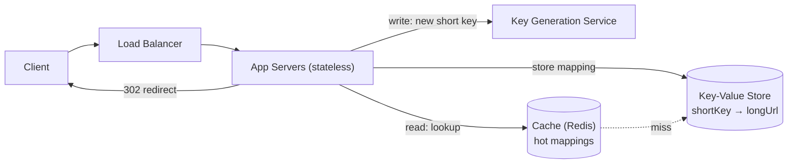
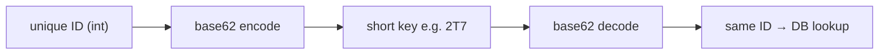
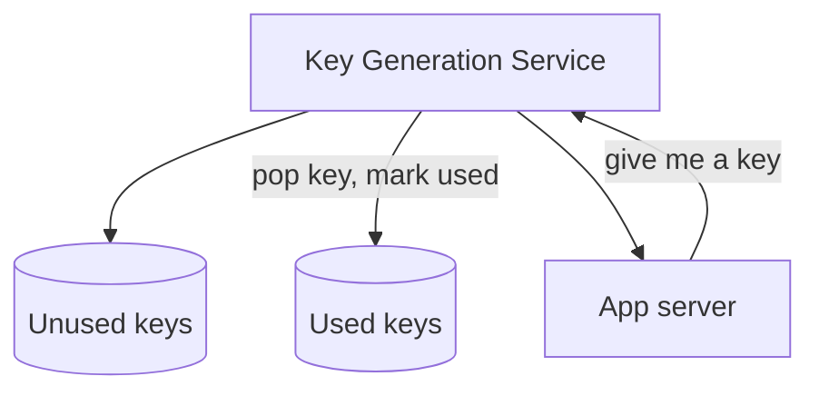
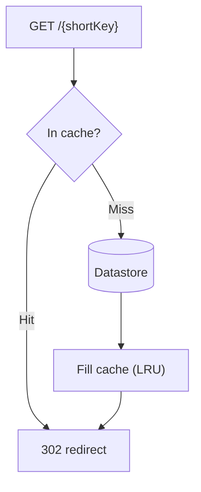
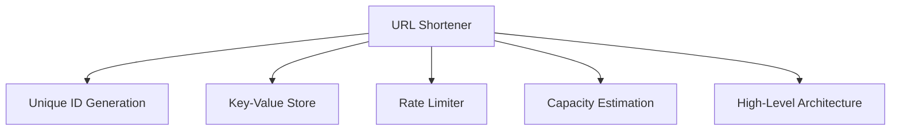

# Designing a URL Shortener (TinyURL / bit.ly)

---

## Brief

A URL shortener turns a long URL into a short alias and redirects anyone who
visits the alias back to the original. `https://example.com/very/long/path?x=1`
becomes `https://sho.rt/aB3xK9`. The two operations are:

- **Shorten:** `POST /shorten { longUrl }` → returns a short URL.
- **Redirect:** `GET /{shortKey}` → HTTP redirect to the long URL.

It's a classic interview problem because it's small on the surface but exercises
**key generation, read-heavy caching, storage at scale, and redirects**.

### Requirements

- **Functional:** create a short link; redirect to the original; optional custom
  alias, expiration (TTL), and click analytics.
- **Non-functional:** very **read-heavy**, redirects must be **low latency**,
  **highly available** (a dead redirect breaks every link ever shared), and
  short keys should be **non-guessable / non-sequential** where possible.

---

## 1. Capacity Estimation

```text
Assumptions
  New URLs (writes):     100 million / day
  Read:write ratio:      10:1   (redirects >> creations)
  Retention:             5 years
  Record size:           ~500 bytes (short key, long URL, metadata)

Throughput
  Write QPS = 100,000,000 / 86,400        ≈ 1,160 writes/s
  Read  QPS = 1,160 × 10                   ≈ 11,600 reads/s
  Peak (3×) ≈ ~35,000 reads/s

Storage (5 years)
  100M/day × 365 × 5                       ≈ 182 billion URLs
  182B × 500 bytes                         ≈ 91 TB

Short key length (base62: a–z A–Z 0–9)
  62^6 ≈ 56 billion        (too few for 182B)
  62^7 ≈ 3.5 trillion      (enough)  →  use a 7-character key
```

Read-heavy + "must be fast" ⇒ a **cache in front of the datastore** is the key
design driver. (See [Capacity Estimation](/system-design/capacity/backend-capacity)
for the method.)

---

## 2. High-Level Design



- **Write path:** app server gets a unique short key (from the Key Generation
  Service), stores `shortKey → longUrl` in the datastore, returns the short URL.
- **Read path:** app server looks up the short key (cache first, then DB) and
  returns an HTTP redirect to the long URL.
- **Stateless app servers** behind a load balancer scale horizontally (see
  [Stateless vs Stateful](/system-design/basics/stateless-stateful)).

---

## 3. Design Deep Dive (LLD)

### How to generate the short key

The crux of the problem. Three common approaches:

| Approach | How | Trade-off |
| --- | --- | --- |
| **Hash the long URL** | `base62(md5(longUrl))[:7]` | Same URL → same key (free dedup), but **collisions** need handling (rehash / append salt) |
| **Encode a unique ID** | Generate a unique 64-bit ID, then **base62-encode** it | **No collisions**; but keys are sequential/guessable unless the ID is (see below) |
| **Key Generation Service (KGS)** | Pre-generate random unused keys offline, hand them out | No collisions, fast at request time; adds a service to operate |

**Recommended: ID → base62, or a KGS.** The ID approach ties directly to
[Unique ID Generation](/system-design/basics/unique-id-generator) (counter,
ticket server, or Snowflake).

### base62 encoding

Map a numeric ID into `[0-9a-zA-Z]` (62 symbols) to get a short, URL-safe key:

```text
id = 11157
11157 / 62 = 179 r 59 → '7'   (digits: 0-9, a-z=10-35, A-Z=36-61)
  179 / 62 =   2 r 55 → 'T'
    2 / 62 =   0 r  2 → '2'
read remainders bottom-up → "2T7"
```



A 7-char base62 key covers 62⁷ ≈ 3.5 trillion values — plenty.

> If sequential keys are a concern (guessable, enumerable), feed the encoder a
> **Snowflake-style** or randomized ID instead of a plain `+1` counter, or use a
> KGS that pre-generates **random** keys.

### Key Generation Service (KGS)

A KGS pre-computes random unused keys and stores them in two sets — **unused**
and **used** — so request-time key assignment is just a fast pop.



Concurrency: two app servers must never get the same key. The KGS hands out keys
**atomically** (or loads a block of keys into memory behind a lock). Run a
**standby replica** so the KGS isn't a single point of failure, and keep a buffer
of pre-loaded keys to absorb spikes.

### Datastore

- A **key-value store** fits perfectly: `shortKey → { longUrl, createdAt, ttl,
  ownerId }`. Lookups are by primary key — no joins, easy to **shard** by key.
  (See [Key-Value Store](/system-design/basics/key-value-store).)
- 91 TB over 5 years ⇒ shard across nodes; replicate for availability.

### Cache (the latency win)

Redirects are read-heavy and repetitive (a viral link is hit millions of times),
so cache `shortKey → longUrl`:



- **Cache-aside** with **LRU** eviction; the 80/20 rule means a modest Redis
  cluster absorbs most reads.

### 301 vs 302 redirect

| Code | Meaning | Effect |
| --- | --- | --- |
| **301 Moved Permanently** | Browser caches the redirect | Fewer hits to your server, but you **lose click analytics** (later visits skip you) |
| **302 Found (temporary)** | Browser does **not** cache | Every click hits your server → you can **track analytics** and change the target later |

Use **302** when analytics/flexibility matter (most shorteners); **301** to
minimize load when you don't need per-click tracking.

### Custom aliases, expiration & analytics

- **Custom alias:** check availability in the datastore; reject if taken.
- **Expiration:** store a TTL; a lazy check on read (or a cleanup job) removes
  expired links.
- **Analytics:** don't block the redirect — emit a click event to a **message
  queue** and process it with **workers** asynchronously (see
  [Message Queues](/system-design/basics/message-queues) and
  [Workers](/system-design/basics/workers)).

---

## 4. Issues & How the Design Tackles Them

| Issue | Why it happens | How the design handles it |
| --- | --- | --- |
| **Key collisions** | Hash-based keys can repeat | Use ID→base62 (collision-free) or a KGS; if hashing, detect + rehash with a salt |
| **KGS single point of failure** | One key service for all writes | Standby replica + in-memory buffer of pre-loaded keys |
| **Slow redirects** | DB lookup on every hit | Cache-aside (Redis) in front of the datastore; 302 only when analytics needed |
| **Hot link** | One viral key gets huge traffic | It stays hot in cache; optionally replicate/shard the key |
| **Storage growth** | Billions of rows over years | Shard the KV store by key; enforce TTL/expiration to reclaim space |
| **Analytics load** | Counting every click inline slows redirects | Fire-and-forget to a queue; workers aggregate offline |
| **Abuse (malicious/spam links, scraping)** | Open create endpoint | Auth + **rate limiting** the create API (see [Rate Limiter](/system-design/basics/rate-limiter)); scan/blocklist destinations |

---

## Summary

| Concern | Choice |
| --- | --- |
| Short key | base62-encode a unique ID, or a Key Generation Service |
| Key length | 7 base62 chars (62⁷ ≈ 3.5T) |
| Datastore | Sharded, replicated key-value store |
| Latency | Cache-aside (Redis), LRU |
| Redirect | 302 (trackable) vs 301 (cacheable) |
| Analytics | Async via queue + workers |
| Abuse | Auth + rate limiting on create |

The whole design is shaped by one fact: **reads vastly outnumber writes**, so
the short key must be cheap to generate and the redirect path must be cache-fast.

---

## Concept Map

Click a node to jump to the related note.


