# Workers in Message Queues

---

## Brief

Workers are consumer processes that pull messages from a queue and process them. They are the "execution" part of the message queue pattern. Workers enable asynchronous, distributed task processing.

---

## Worker Pattern

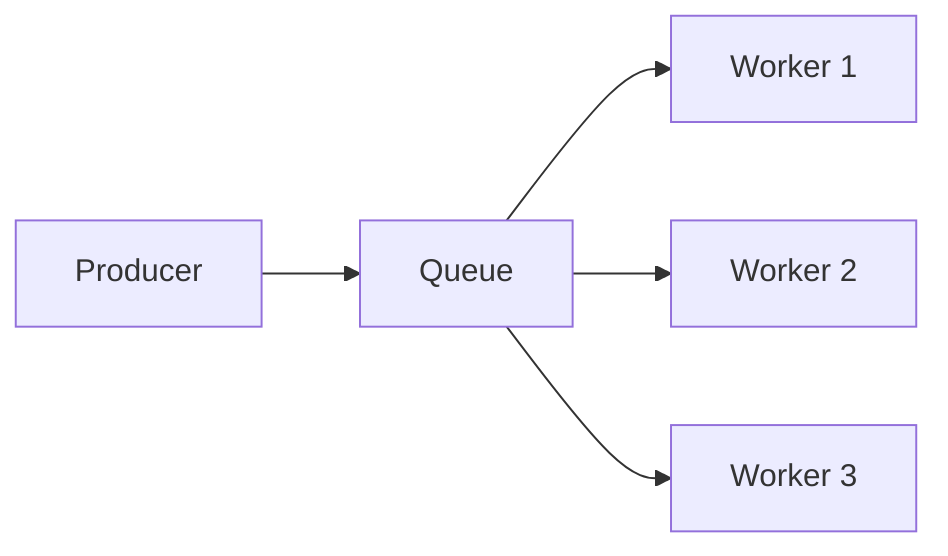

1. Producer sends a task (message) to a queue.
2. A worker picks up the message.
3. Worker processes the task.
4. Worker acknowledges completion (ACK).
5. If worker fails, message is redelivered to another worker.

---

## How Workers Work

### Pull Model (Kafka)

Workers actively poll the broker for new messages.

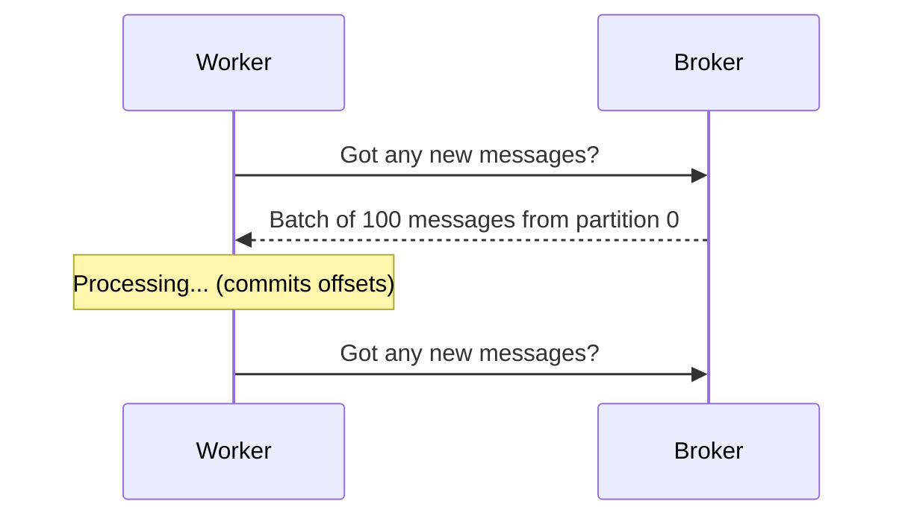

Advantages:
- Workers control their own pace.
- Backpressure is built-in (if workers are slow, they just poll less).
- Good for batch processing.

Disadvantages:
- Higher latency (polling interval).
- Need to manage polling loops and offset commits.

### Push Model (RabbitMQ)

Broker pushes messages to workers.

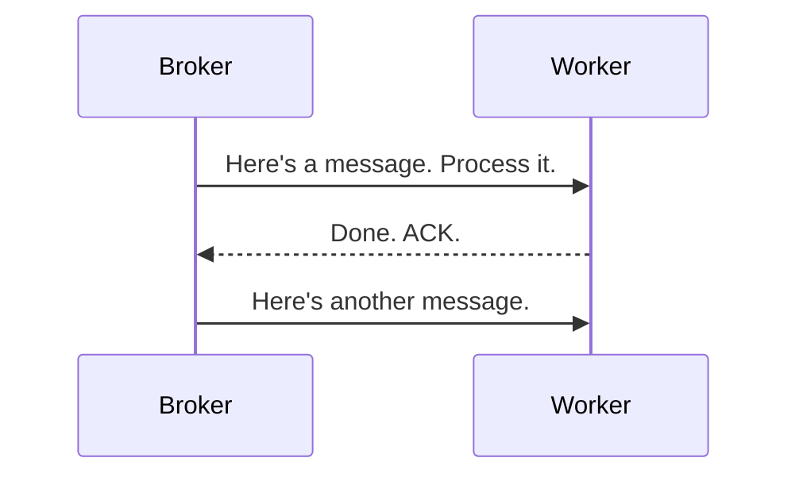

Advantages:
- Lower latency (messages pushed immediately).
- Simple consumer code.

Disadvantages:
- Workers can be overwhelmed (backpressure).
- Need prefetch limits to avoid flooding.

---

## Worker Responsibilities

### 1. Message Consumption

Receive messages from the queue. Handle both pull (polling) and push models.

### 2. Processing

Execute the task: transform data, call APIs, write to DB, generate files, etc.

### 3. Acknowledgement

Tell the broker the message was processed successfully.

- **Auto-ACK**: Broker removes message as soon as it's sent (risk: message lost if worker crashes).
- **Manual ACK**: Worker explicitly ACKs after processing (safe but slower).

### 4. Error Handling

What happens when processing fails:

- **Retry**: Re-queue the message for another attempt.
- **DLQ**: Send to dead-letter queue after max retries.
- **Log**: Record the failure for debugging.

### 5. Idempotency

Workers should handle duplicate messages safely. Since most queues guarantee at-least-once delivery, the same message might be processed twice.

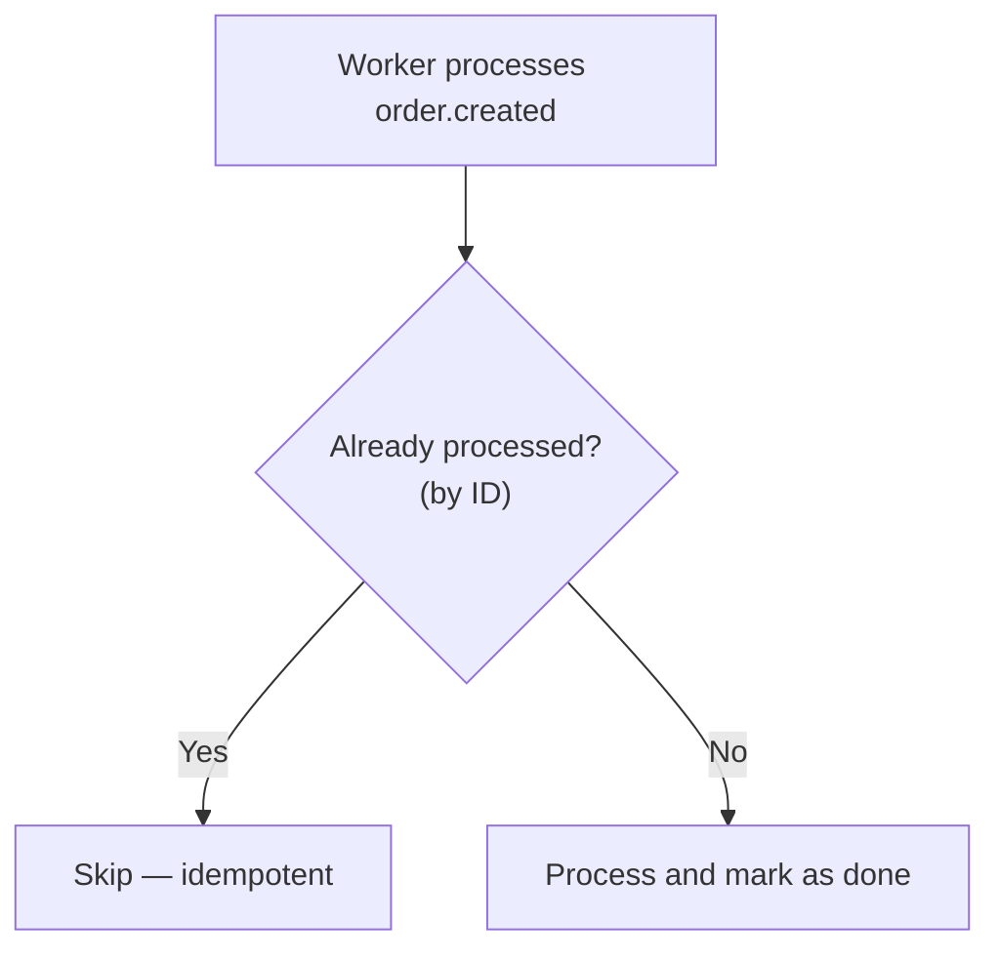

---

## Worker Concurrency

### Single-threaded Worker

Processes one message at a time. Simple but slow.

### Multi-threaded Worker

Multiple threads process messages concurrently from the same queue.

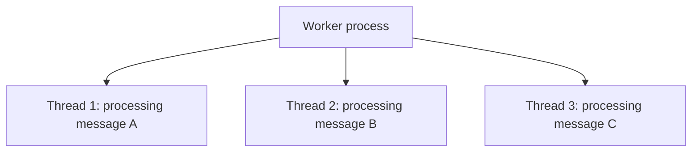

Pros: Higher throughput per worker.
Cons: Race conditions, shared state, ordering lost.

### Multi-process Worker

Multiple OS processes (or containers) work on the queue.

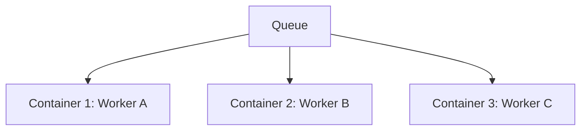

Pros: No shared state, easy scaling.
Cons: More resource overhead.

### Prefetch / Batching Control

- **RabbitMQ prefetch**: How many messages to send a worker before waiting for ACKs. Lower = fairer distribution, higher = better throughput.
- **Kafka batch size**: How many records to return in one poll. Workers can process in batches for efficiency.

---

## Worker Scaling

### Horizontal Scaling

Add more worker instances to handle more load.

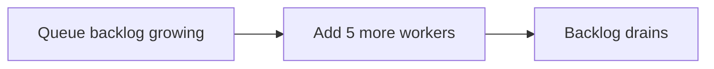

- Autoscaling based on queue depth.
- Works well when workers are stateless.

### Vertical Scaling

Give each worker more CPU/RAM.

- Useful for CPU-intensive tasks (video encoding, image processing).
- Limited by machine size.

### Partition Scaling (Kafka)

Add more partitions to increase parallelism.

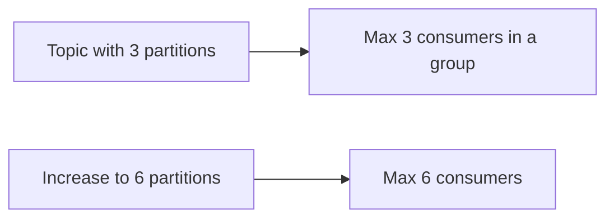

---

## Common Worker Scenarios

### Image Processing

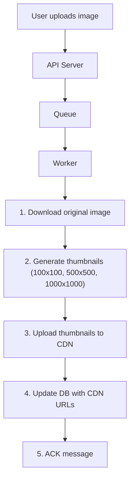

### Email Sending

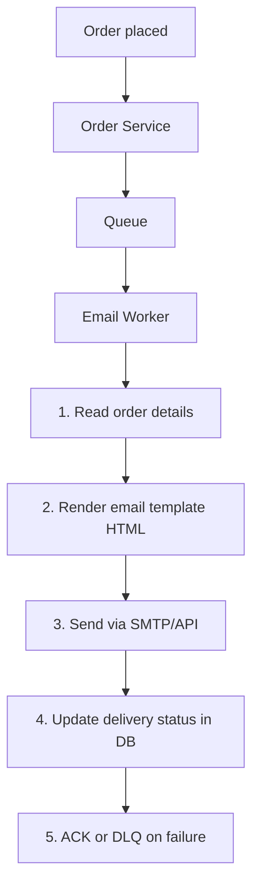

### Video Transcoding

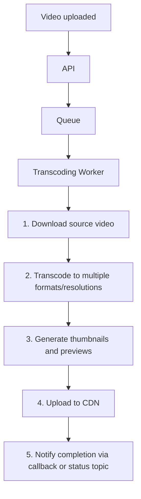

### Scheduled Tasks

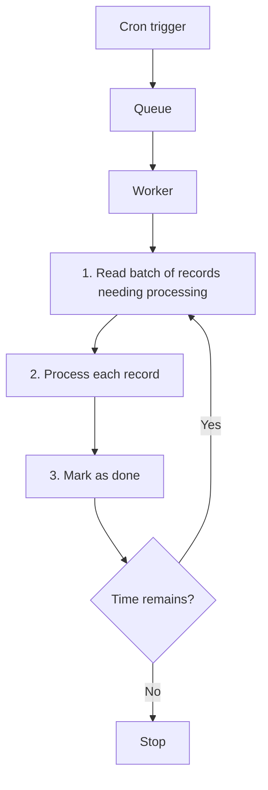

---

## Worker Failure Modes

### Crash During Processing

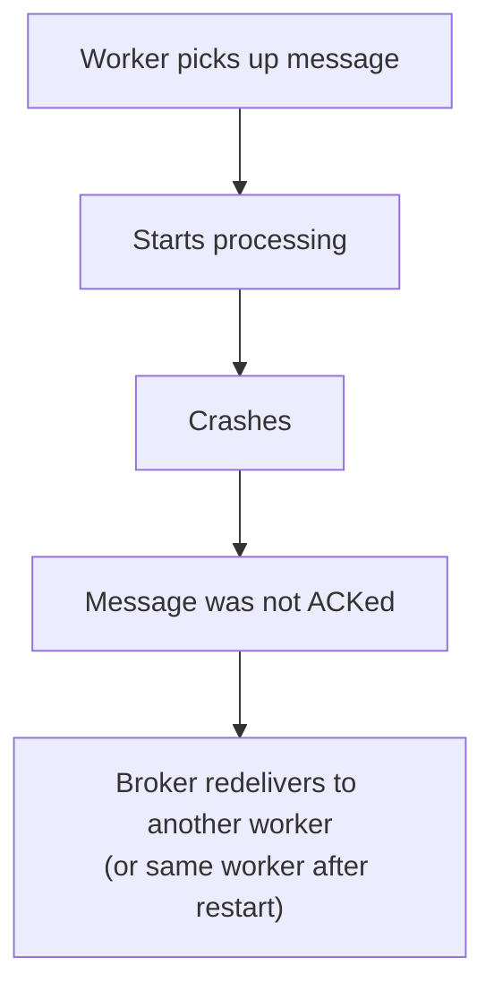

### Poison Pill Message

A message that always fails to process (bad format, missing data).

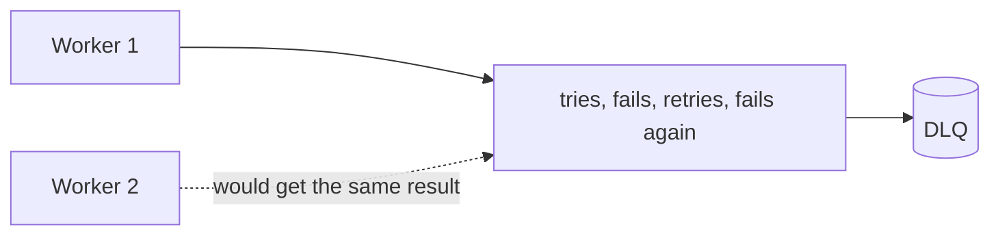

Solution: Track retry count, move to DLQ after limit.

### Slow Worker

A worker that takes too long to process.

```text
- Messages pile up in the queue.
- Other workers finish their messages but can't help.
- Solution: Scale workers, split the task, or time-box processing.
```

### Worker Thundering Herd

All workers restart simultaneously and all try to claim messages.

```text
- Many workers contend for messages.
- Can overwhelm DB or external services.
- Solution: Gradual startup, rate limiting.
```

---

## Monitoring Workers

### Key Metrics

| Metric | What it tells you |
| --- | --- |
| Queue depth | How many messages are waiting |
| Processing time | How long each message takes |
| Success/failure rate | Error rate, health of system |
| Worker count | How many workers are active |
| Message age | How long messages have been waiting |
| Retry count | How many times messages are retried |

### Alerts

- Queue depth growing (workers can't keep up).
- High failure rate (bad messages or system issue).
- No active workers (deployment or config issue).
- Messages in DLQ (need manual inspection).

---

## Summary

| Concept | Description |
| --- | --- |
| Worker | Consumer that pulls and processes queue messages |
| ACK | Confirmation that message was processed successfully |
| Concurrency | Multi-thread, multi-process, or multi-instance |
| Scaling | Add workers (horizontal) or increase resources (vertical) |
| Error handling | Retry, DLQ, idempotent processing |
| Backpressure | Workers control pace in pull model; prefetch limits in push model |
| Monitoring | Queue depth, processing time, error rate, worker count |
