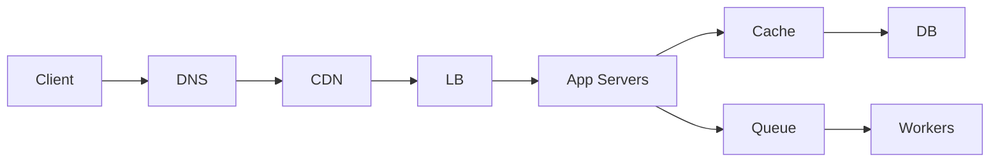

# System Design Interview Framework

---

## Brief

A system design interview evaluates your ability to architect large-scale distributed systems. The expectation is not a perfect design — it's structured thinking, trade-off awareness, and clear communication.

Most interviews are 45 minutes. The 4-step framework below helps you pace yourself and cover what matters.

---

## Time Distribution (45 min)

| Step | Duration | What happens |
| --- | --- | --- |
| 1. Understand & Clarify | 10 min | Ask questions, define scope, agree on requirements |
| 2. Propose HLD & Get Buy-in | 10 min | Sketch high-level design, walk through components |
| 3. Deep Dive (LLD) | 20 min | Detail specific components, discuss trade-offs, handle bottlenecks |
| 4. Wrap Up | 5 min | Recap design, identify improvements, next steps |

---

## Step 1: Understand & Clarify (10 min)

### Goal

Don't start designing immediately. Understand the problem deeply. Ask clarifying questions to scope the system.

### What to Establish

| Aspect | Questions to ask |
| --- | --- |
| Functional requirements | What features does the system need? What are the primary use cases? |
| Non-functional requirements | What are the scale expectations? Latency? Availability? Consistency? |
| Constraints | Budget? Time? Team size? Existing infrastructure? |
| Users | Who are the users? How many? Global or regional? |
| Traffic patterns | Read-heavy or write-heavy? Real-time or async? |

### Most Common Interview Questions

| Question | Focus |
| --- | --- |
| Design URL shortener (TinyURL) | Key generation, redirection, analytics, storage |
| Design a chat system | WebSockets, presence, message ordering, history |
| Design a news feed / social feed | Fan-out, ranking, caching, real-time updates |
| Design Uber / ride-sharing | Location service, matching, ETA, surge pricing |
| Design Instagram / photo sharing | Upload, CDN, feed generation, storage |
| Design Twitter | Tweet posting, timeline, fan-out, search |
| Design YouTube / Netflix | Video upload, transcoding, CDN, recommendation |
| Design a rate limiter | Token bucket, sliding window, distributed rate limiting |
| Design a web crawler | URL frontier, politeness, deduplication, storage |
| Design a notification system | Push, email, SMS, templates, delivery guarantees |
| Design a key-value store | CAP theorem, consistency, partitioning, replication |
| Design a distributed database | Sharding, replication, consensus, transactions |
| Design a file storage service (Google Drive / Dropbox) | Sync, conflict resolution, chunking, versioning |
| Design a CDN | Caching strategies, origin shield, edge nodes |
| Design a payment system | Idempotency, ledger, reconciliation, fraud detection |
| Design a search autocomplete / typeahead | Trie, top-K, caching, real-time updates |
| Design a collaborative editor (Google Docs) | CRDT / OT, conflict resolution, websockets |
| Design an API gateway / load balancer | Routing, rate limiting, auth, observability |

### Clarifying Questions Checklist

```
Functional:
  - What are the core features? (MVP vs nice-to-have)
  - Who can do what? (auth, roles)
  - Is it read-heavy or write-heavy?
  - Real-time or async?

Non-functional:
  - DAU / MAU?
  - Expected QPS and peak QPS?
  - Latency requirements (p99, p999)?
  - Availability SLA (99.9% vs 99.99%)?
  - Consistency trade-offs (strong vs eventual)?

Data:
  - How much data per user?
  - Retention period?
  - Do we need analytics / reporting?
```

---

## Step 2: Propose HLD & Get Buy-in (10 min)

### Goal

Sketch the high-level architecture on a whiteboard / diagram. Name the main components and explain how data flows through the system.

### High-Level Building Blocks



### Components to Call Out

- **Client**: Web, mobile, third-party API.
- **DNS + CDN**: Static assets, geo-routing.
- **Load Balancer**: L4 vs L7, health checks, SSL termination.
- **App Servers**: Stateless, business logic, API endpoints.
- **Cache**: Redis / Memcached, cache-aside or write-through.
- **DB**: SQL vs NoSQL, read replicas, sharding.
- **Queue + Workers**: Async processing, decoupling.
- **Storage**: S3 / Blob for files, images, videos.

### What to Show

1. System diagram with main components.
2. Data flow for the primary use case (e.g., "user creates a post").
3. Read-path and write-path.

### Get Buy-in

```text
"This is the high-level design. The main components are X, Y, Z.
Data flows like this: A -> B -> C.
For the read path, I'm using a cache to reduce DB load.
For the write path, I'm using a queue for async processing.
Does this look reasonable? Any area you want me to dive deeper on?"
```

---

## Step 3: Design Deep Dive — LLD (20 min)

### Goal

Pick 2-3 components identified in the HLD and go deep. The interviewer will guide which areas they want detail on.

### Common Deep Dive Areas

| Component | What to dive into |
| --- | --- |
| Database | Schema design, indexes, sharding strategy, replication, consistency model |
| Cache | Eviction policy (LRU, LFU, TTL), cache invalidation, distributed caching |
| Queue | Ordering guarantees, exactly-once vs at-least-once, consumer groups |
| API design | REST vs gRPC, pagination, rate limiting, authentication |
| Storage | Chunking strategy, replication, durability, file metadata schema |

### Databases: Sharding Strategies

| Strategy | How it works | Trade-offs |
| --- | --- | --- |
| Range-based | Split by ID range (0-1000, 1001-2000) | Hot spots if IDs not evenly distributed |
| Hash-based | Hash key and mod by N | Even distribution, but resharding is painful |
| Directory | Lookup table mapping key -> shard | Single point of failure, extra hop |
| Geo-based | Shard by region | Works for location-aware data |

### Databases: Replication

| Strategy | How it works | Trade-offs |
| --- | --- | --- |
| Single leader | One primary, multiple replicas | Writes bottlenecked on primary |
| Multi-leader | Multiple writable nodes | Conflict resolution needed |
| Leaderless | Any node accepts writes | Read repair, consistency challenges |

### Caching Patterns

| Pattern | How it works | When to use |
| --- | --- | --- |
| Cache-aside | Read cache -> miss -> read DB -> update cache | Read-heavy, moderate write |
| Write-through | Write cache -> cache writes DB | Write-heavy, strong consistency |
| Write-behind | Write cache -> async write DB | Write-heavy, tolerate slight lag |
| Read-through | Cache loads from DB on miss | Simple, cache handles logic |

### Consistency Models

| Model | Guarantee | Use case |
| --- | --- | --- |
| Strong | Read always sees latest write | Payments, inventory |
| Eventual | Replicas converge over time | Feeds, search indexing |
| Causal | Related events in order, unrelated can be out of order | Chat, social graph |
| Read-your-writes | User sees their own writes immediately | User profile |

### Bottlenecks & How to Handle

| Bottleneck | Symptom | Solution |
| --- | --- | --- |
| DB read heavy | High read QPS, slow queries | Read replicas, cache, denormalize |
| DB write heavy | Write contention, slow inserts | Shard, batch writes, async queue |
| Hot key | Single key gets disproportionate traffic | Cache it, shard the key, local cache |
| Large files | Slow upload/download, bandwidth cost | CDN, chunked upload, compression |
| Slow consumers | Queue backlog growing | Scale workers, optimize processing |
| Network bandwidth | Throughput capped | Compress payload, CDN, edge compute |
| Connection limits | DB can't handle connections | Connection pooling, read replicas |
| Single point of failure | Component goes down, system breaks | Redundancy, failover, health checks |

### Failures & How to Handle

| Failure | Impact | Mitigation |
| --- | --- | --- |
| Server crash | Requests lost | Load balancer health checks, auto-restart |
| DB primary failure | Writes unavailable | Automatic failover to replica, promote new primary |
| Cache failure | Increased DB load | Circuit breaker, degrade gracefully |
| Queue broker failure | Messages lost | Persistent queues, replication, retry |
| Network partition | Split-brain | Consensus algorithm (Raft/Paxos), quorum |
| Downstream API failure | Service unavailable | Circuit breaker, fallback, timeout |
| Disk full | System crash | Monitoring, auto-scaling storage, log rotation |
| Memory leak | OOM kills | Monitoring, auto-restart, leak detection |

### Operational Issues & How to Handle

| Issue | Mitigation |
| --- | --- |
| Deployment rollback | Blue-green deployment, feature flags |
| Monitoring gaps | Metrics (QPS, latency, error rate, saturation), dashboards |
| Debugging production | Structured logging, distributed tracing, correlation IDs |
| Capacity planning | Autoscaling, load testing, headroom |
| Secret management | Vault / AWS Secrets Manager, never in code |
| Backups | Automated, tested restore process |
| Data migration | Forward-compatible schema changes, backfill scripts |

---

## Step 4: Wrap Up (5 min)

### Goal

Summarize the design, acknowledge trade-offs, identify potential improvements, and discuss monitoring / operations.

### What to Cover

```
1. Recap the high-level design briefly (30 seconds).
2. What's good about this design:
   - Stateless app servers scale horizontally.
   - Cache reduces DB load.
   - Queue decouples async processing.
3. What could be improved:
   - If time allowed, I'd add...
   - For higher scale, we'd need to...
   - Security hardening: rate limiting, DDoS protection.
4. Monitoring & observability:
   - Metrics: QPS, latency p50/p99, error rate, queue depth.
   - Logging: structured logs, correlation ID.
   - Alerts: pager on high error rate or increased latency.
5. Ask the interviewer: "Is there anything you'd like me to elaborate on?"
```

### Sample Wrap Up Script

```text
"To summarize, we designed a system with:
  - Stateless app servers behind an L7 load balancer.
  - Redis cache to handle read-heavy traffic.
  - PostgreSQL with read replicas, sharded by user ID.
  - A Kafka queue for async processing with worker auto-scaling.

Trade-offs we made:
  - We chose eventual consistency for the feed to keep writes fast.
  - Sharding makes resharding painful, but it handles our scale.

If we had more time, I'd add:
  - A CDN for static assets and image caching.
  - Distributed tracing for debugging.
  - Multi-region deployment for disaster recovery.

Any questions?"
```

---

## Interview Framework Cheatsheet

### 45-min Timeline

```text
0:00 - 0:10  Understand & Clarify (requirements, scale, constraints)
0:10 - 0:20  Propose HLD (diagram, components, data flow)
0:20 - 0:40  Deep Dive (schema, cache, sharding, bottlenecks, failures)
0:40 - 0:45  Wrap Up (recap, trade-offs, improvements)
```

### What to Keep in Mind

| Do | Don't |
| --- | --- |
| Ask clarifying questions before designing | Jump straight into a solution |
| State trade-offs explicitly | Pretend there's a perfect design |
| Talk through your reasoning | Design in silence |
| Start simple, then optimize | Over-engineer from the start |
| Use back-of-envelope calculations | Give vague scale estimates |
| Consider failure modes | Assume everything works perfectly |
| Mention monitoring and ops | Only talk about happy path |

### Common Mistakes

| Mistake | Why it hurts |
| --- | --- |
| Silent design | Interviewer can't follow your thought process |
| Skipping requirements | You design the wrong system |
| Ignoring scale | System works for 100 users but not 100 million |
| No trade-off discussion | Looks like you don't understand alternatives |
| Over-engineering | Using Kafka for a simple task queue |
| Missing failure cases | Shows lack of production experience |
| No numbers | Can't justify server count or storage estimates |

### Backup Calculations (Rough Numbers)

```text
DAU to QPS:       QPS = DAU × req/user/day / 86,400
Peak:             2-3x average QPS
Server capacity:  ~500-2000 req/s depending on framework
DB write capacity: ~10-50k writes/s per node
Cache:            ~100k ops/s per Redis node
Bandwidth:        QPS × avg response size × 8 = bps
Storage:          DAU × data/user × retention
```

---

## Summary

| Step | Time | Key actions |
| --- | --- | --- |
| 1. Understand | 10 min | Clarify requirements, ask about scale, constraints, users |
| 2. HLD | 10 min | Sketch diagram, explain data flow, get agreement |
| 3. Deep Dive | 20 min | Dive into DB, cache, sharding, bottlenecks, failures, ops |
| 4. Wrap Up | 5 min | Recap, trade-offs, improvements, monitoring |
